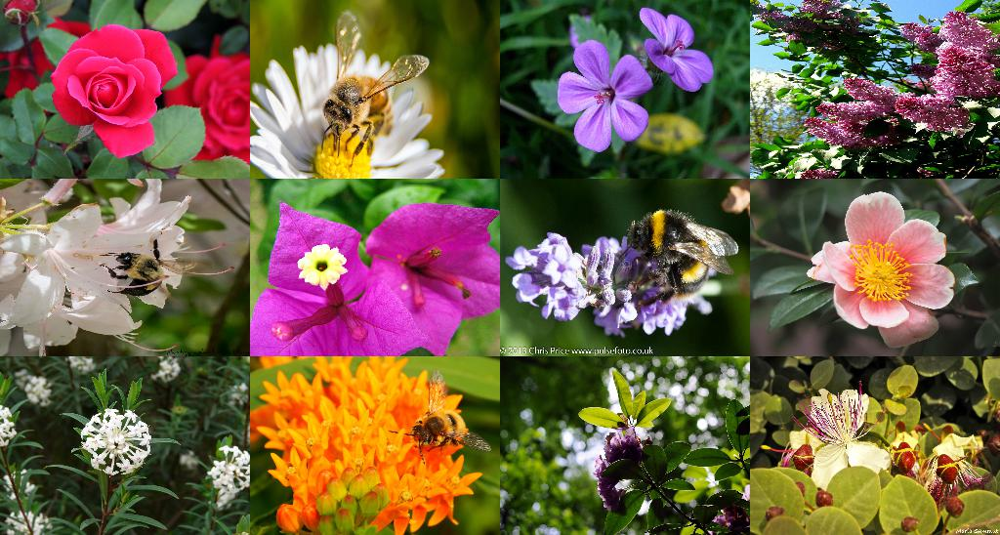
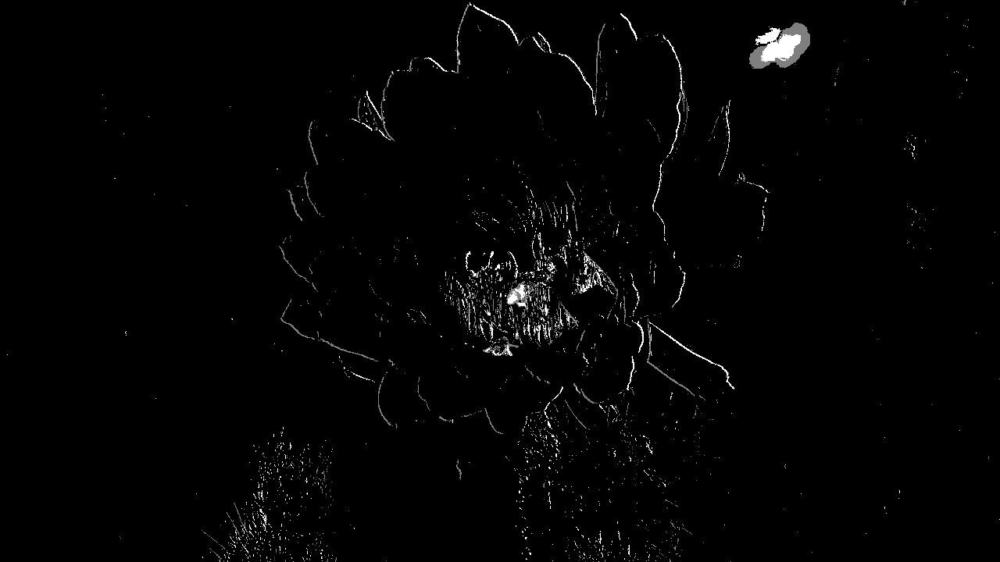
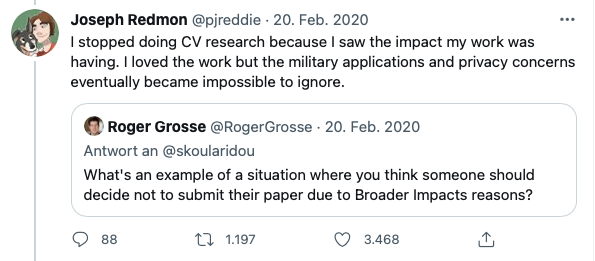
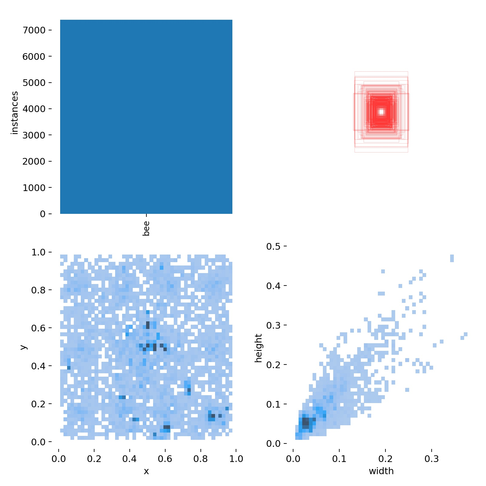
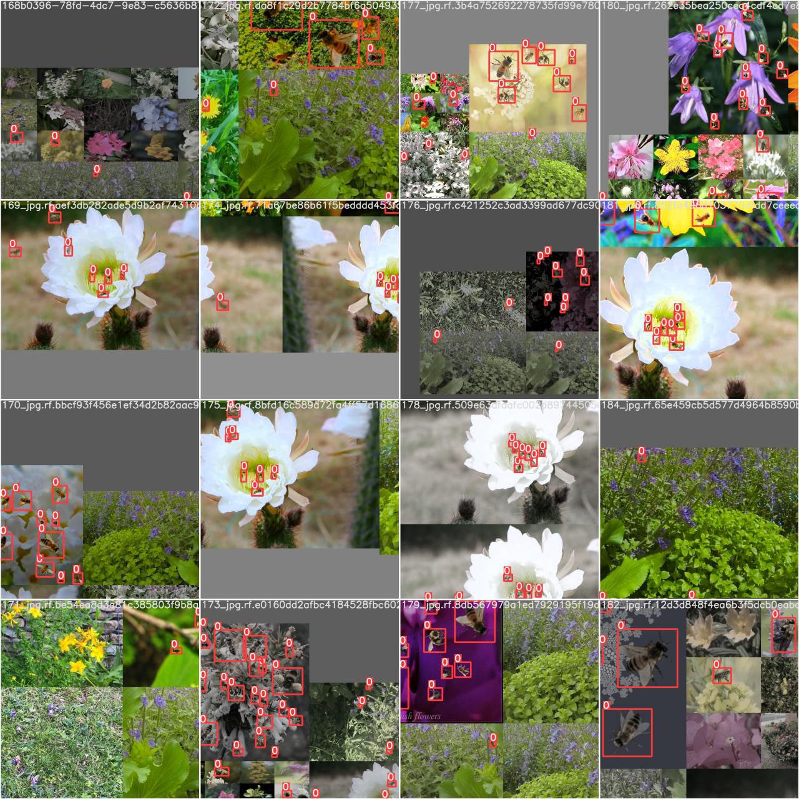

# BeeWatch

## Motivation
(Christin Scheib)  
Insects such as bees, wasps, flies and beetles are the most important pollinators of wild and cultivated plants. From the 109 most important crops such as apples, strawberries, almonds, tomatos and melons,  about 80 % completely depend on the pollination of animals. [1] The total economic value generated by that is estimated to be around 153 billion euros per year worldwide. [2] Thinking of bees, wild bees are often underestimated in their importance when it comes to pollination. While the honey bee is only responsible for at most one third of the pollination services, the remaining two third is done by wild bees and other wild pollinators such as the bumblebee. [3] However, entomologists worldwide have been oberserving a severe decline in the population of pollinating animals. Mostly affected by this are honey bees as well as wild bees. [4] As the global agriculture sector depends on the pollination of insects the global decline is a severe threat for our ecosystem and the industries. [5] In order to counteract on this trend it is imperative to understand the root causes. Several contibution factors such as harmful pesticides, parasites, diseases, malnutrition, intruders, urbanisation and intensive monoculture cultivation have been found to lead to this global decline. [6, 7, 8, 9, 10] As these are only a subset of all the contributing factors it is hard to understand what caused a local rise in the bee mortality. 

Um die lokalen Ursachen zu erforschen, die Bienensterben verursachen ist ein Ansatz das Bee monitoring. Diese Klassischen Ansätze sind nicht besonderes Tierfreundlich(eindringen in deren Umgebung, mitnahme in Labor ). Aus diesem Grund wollen wir ansetzten und eine Bienenfreundlichen Lösung entwickeln wire Bienn beobachtet/gezählt werden können ohne sie dabei in ihrem natürlichen Habitat stören. Dies würde meghrewre Vorteile bringen: Ursachenforschung betreiben, Bienen sind ein guter Bioindikator. 

## Description of the Use Case
(Aleksandar Ilievski)  
One approach to understand the factors in the rise of bee mortality is to monitor local activities of wild bee communities. This allows to draw conclusions of the current state of their environment and its effects on wild bees. Negative changes in wild bee activity such as a decline in the number of wild bees in an area can bring light to issues regarding the local ecosystem. As mentioned before, these issues can range from natural factors such as weather and climate changes to human factors such as the impact of agriculture and pollution. This can be a starting point for further investigations to find and eliminate factors causing this decline. At the same time, a rise in wild bee activity after implementing actions to eliminate the identified problems is a measure for a successful recovery of a local ecosystem.  

The reason this approach works so well is because wild bees are great bioindicators. There are around 750 different species of wild bees in Central Europe, and they have an average operating radius of around 100-300 meters but can go up to 1500 meters at maximum. Wild bees are also the most efficient pollinators and are oftentimes highly specialized on the pollination of specific plants. Therefore, a species-rich wild bee community is important for maintaining biodiversity in a local landscape. At the same time, wild bees are highly sensitive to their immediate environment which is why negative changes in the local ecosystem will show in their activity.[11] [12]  --> weil sie so einen kleinen radius haben. Dies sollte verküpft werde. Nicht nur sensitiv auf negativ changes.

Using wild bees for environmental monitoring is not a new concept. In fact, the idea dates back to 1935 and has since been used to detect impacts of pollution on the environment and pass important environmental-friendly regulations. Methods of wild bee monitoring include counting the number of wild bees visiting a flower, catching living bees with nets or with a variety of types of traps or counting dead bees in a beehive. [13][14](TODO:Wild bees leben nicht in bee hive, nur honey bees ) While traditional approaches have been executed manually, newer approaches utilize modern technologies to accelerate the monitoring process. Such technologies can include RFID tags, beehive monitoring through built-in sensors or using cameras and image processing. [15] This is where we want to make our contribution: we want to automize the wild bee monitoring process by creating an automated quantitative tracking system using computer vision methods. 

There are existing papers that have already implemented computer vision powered monitoring systems such as Ratnayake, M. N., Dyer, A. G., & Dorin, A. (2021) who have used a combination of a YOLOv2 network and background subtraction to implement a bee tracking system [16]. Their work is used as a starting point for our own bee tracking system. Our tracking system solely focuses on bee tracking i.e., counting the number of bees within a specific time frame. It does not, however, classify different bee species, as they are hard to distinguish. 

(TODO: Unseren use case müssen wir noch viel deutlicher herausarbeiten! 
1. Wir können nicht unterscheiden zw. wild und honey bees--> deshalb sollte der fokus nicht ausschließlich darauf ligeen. Idee: Begründen dass wildbienen extram wichtig zu beobachten sind weil sie aussagen über ihre unmittelbare umgebung machen. Probekm in vggl. zur Honigbiene ist, dass sie nicht in Bee hives wohenen in grßen Kolonien sondern verzeinzelt in Totholz, Mauer usw. --> deshalb schauen wir uns nicht Bee hives an sondern setzten direkt am Ort der Bestäubung an
2. Mehr ber Traditionalle Methoden des Bee monitoring recherchieren und das unseren Use case passend einordnen. Sagen auch was die Nachteile davon sind. Was mir spontan einfällt: invasion in ihr natürliches Habitar, In netz gefangen zu werden ist enormer stress und ich glaube bei manchen fallen sterben sie auch -->  Dafür brucht man aber überall quellen
3. Perobelem mit der Unterscheidung: Wie oben beschrieben gibt es extrem viele Wildbienen die sehr schwer zu unterscheiden sind. Dafür sindspezialisten nötig, die das teilweise auch nur unter dem Mikroskop machen können. Aus diesem Grund werden diese Bienen potenziell bei diesen Bienensammlungen mit ins Labor genommen. Dieses Probelm können wir mit unserem Ansatz auch nicht lösen 
4. Weitere Literaturrechereche betreiben. Es gibt auf jeden fall mehr paper die sich damit beschäftigen (Bienenerkennung mit Computervision)
5. Userbereich ausformulieren  
6. Problem statement mit Zielsetzung formulieren , bisschen von der Art wie eine Forshungsfrage 
7. Was machen andere STartups in dem Bereich : Apic, dann das in Zürich usw. gerne noch weiter schauen
8. Was macht unsere methode so nice --> anscheined haben wir eins der "lieblingthemen" deshalb diesen Vorteil ausschlachten

Since wild bees are powerful bioindicators, a bee tracking system could be of interest for a broad base of potential customers, such as
-	the manufacturing industry for monitoring the effects of air and soil pollution,
-	farmers for monitoring and regulating the effects of pesticide usage,
-	beekeepers and beekeeping associations for gaining insights into the state of their own bee colonies,
-	regulatory and research institutions for monitoring biodiversity in regions, supporting research projects and passing regulations in case of violations.

## Data Gathering
(Aleksandar Ilievski)  
For the data collection process, pictures and videos were taken of bees using different devices. A summary of the devices that were used can be found in the table below. The data collection process proved to be difficult for a multitude of reasons. First, bee activity is highly dependent on the weather. Since the project started in the end of April, the weather in Karlsruhe was very rainy. In May, Karlsruhe had 22 rainy days and in June there were 17 [17]. This meant that there was quite a short time frame for data collection. During the first data collection round there was also a lot of wind which caused movement of plants in the videos. This is particularly problematic for the usage of background subtraction, since it creates a lot of noise in the footage. In general, collecting data outside can be difficult because the quality of data is also impacted by sunlight exposure which is something the model needs to be robust again and thus, proving this use case to be quite complex. Second, it is challenging to take pictures of living insects as they are very small and move fast. When there was wind, the bees tended to move even more rapidly. Therefore, taking a clear picture from an acceptable distance took some practice in the beginning. The third problem is when bees are covered by plants. When a big part of the bee body is hidden, it is difficult to spot the bee and thus, not very helpful in training the model.  

| Device        | Camera/Resolution  |
| ------------- |:-------------:|
| iPhone 7      | 12 MP         |  
| iPhone 11 Pro | 12 MP         |
| iPhone 12 Pro | 12 MP         |


### Labeling 
(David Blumenthal)
For the initial labeling the [VGG Image Annotator](http://www.robots.ox.ac.uk/~vgg/software/via/via-1.0.6.html) was used. In order to distribute the effort and to work efficiently, we decided that everyone should label the images they had taken themselves and then later merge them into a single data set. This quickly led to problems when merging, as e.g. label names were assigned differently or not at all. The limited export functionality (its own format, which is not common and Coco json format where we had problems exporting) made us witch to another editor, because we experimented with different models and frameworks and therefore required different formats. This lead us to the holistic object detection platform [Roboflow](https://roboflow.com) which offers several export formats. 

The final Dataset consists of 1.814 images with 104 null examples. Each image has 1.1 annotations on average with results in 2.047 annotation overall with one class [bee]. Images are annotated with bounding boxes.

### Dataset (David)

| Image source  | count         |
| ------------- |:-------------:|
| [Malika Nisal Ratnayake et. al.](https://bridges.monash.edu/articles/dataset/Honeybee_video_tracking_data/12895433)| 436       |  
| own images    | 1398           

Images where either taken as a single photo, or a video was taken and then deconstructed into single frames. To turn videos into single frames [FFmpeg](https://www.ffmpeg.org) was used. 
Images with various different backgrounds (flowers) are included - and selection of sample images can be seen below.

<p float="left">
  
   
  
  
</p>

### Additional data sources (Maximilian Nitsche)
The collected image footage is quite limited regarding the diversitiy of different flower types and colors. As the performance of computer vision applications primarly depend on the quality ("Garbage in, garbage out") and especially the diversity of the training dataset, we decided to complement the collected data by a more comprehensive and diverse set of images. Therefore we first [downloaded](dataset/flickr_dataset_collection.ipynb) and [labeled](###Labeling) an additional batch of 1000 bee images and two videos, which were seperated into individual frames. Moreover, we downloaded 1000 images of flowers or bushes without any bees as these are especially usefull as null images and were used for the proceeding synthetic generation of another 1000 bee images (see [Synthetic dataset generation](####Synthetic-dataset-generation)).
The resulting additional datasets are listed below.

| Image source  | No. of images  |  No. of labels | No. of null images |
| ------------- | ------------- | ------------- | ------------- |
| Flickr - (Mosaic) images| 1000  |  1034 | 0
| Flickr - Video frames | 741 (360 + 381) |  2398 | 167 
| Synthetic images  | 1000     | 7801 | 0

#### Mosaic dataset (Maximilian Nitsche)
In order to collect another 1000 bee images we picked the public image and video hosting platform [flickr](https://www.flickr.com) to do a structured search string query. Flickr is due to the extensive supply of word-tagged images from various domains a common and well-known tool for the creation of computer vision datasets. In order for us to comply with data privacy and protection guidelines, we only queried images listed under creative common licence. 
As the quality of the queried images heavily depend on the search string, we evaluated various keywords in advance. The search strings were iteratively evluated by a brief review of the responses and resulted in the following final search string: "bee flowers", "flowers" and "flower bushes". The latter were used for the [synthetic dataset generation](####Synthetic-dataset-generation) as background images.

After labeling bees in the downloaded datasets following the procedure presented in the [labeling section](###labeling) we used them to generate mosaic data. The mosaic augmentation is originally motivated in the YOLOv4 release and contributes significantly to its performance boost ([Bochkovskiy et al., 2020](literature/Bochkovskiy%20et%20al.%20(2020)%20-%20YOLOv4:%20Optimal%20Speed%20and%20Accuracy%20of%20Object%20Detection.pdf)). As the downloaded images often show only individual bees on one flower the mosaic augmentation also makes sure the data meets our use case requirements to detect bees from further distance. In order to scale down the queried bees and benefit from the stated performance increase in model implementations beside YOLOv4/5 we generated 3x4 mosaic images and the corresponding new annotation files (see [mosaic_data_augmentation.ipynb](dataset/mosaic_data_augmentation.ipynb)). The probability of a bee image to be chosen for a individual mosaic tile was set to 0.3. The following shows an example mosaic image:



#### Synthetic dataset generation
(Andrea Bartos)

#### Data Augmentation
(Andrea Bartos)

#### Data Preprocessing / Final Dataset (David)

Größe der Train/Val/Test split 

In the first trials, we did not succeed in achieving good results for various reasons. One of the reasons was that the variance in the backgrounds (flowers) was very low, but in the validation set flowers, of which there were few or none in the training data set managed to make up the majority. In further attempts to build the dataset, the images were better distributed across the splits, which meant that the results were suddenly very good. The reason for this was that the majority of the images consisted of videos. From these, consecutive frames - which did not differ much - ended up in the training and validation dataset. This in turn led to the model having very good metrics, but not performing well on a test video. The same problem occurred both with rather large bees in test and small ones in val or vice versa. It took several iterations before a balanced data set emerged from the above problems. 


### xxx
In the first trials, we did not succeed in achieving good results for various reasons. One of the reasons was that the variance in the backgrounds (flowers) was very low, but in the validation set flowers, of which there were few or none in the training data set managed to make up the majority. In further attempts to build the dataset, the images were better distributed across the splits, which meant that the results were suddenly very good. The reason for this was that the majority of the images consisted of videos. From these, consecutive frames - which did not differ much - ended up in the training and validation dataset. This in turn led to the model having very good metrics, but not performing well on a test video. The same problem occurred both with rather large bees in test and small ones in val or vice versa. It took several iterations before a balanced data set emerged from the above problems. 


## Model


### Establish Baseline with background subtraction and blob detection
(Aleks)


### Background subtraction + Tiny YOLO (Maximilian Nitsche)
During the labeling process we noticed ourselves that bees are much easier to localize by the human eye if you face a series of frames and see the differences between frames instead of each frame individually. As CNNs themselves are somewhat motivated by the biological eye, we tried to transfer this finding to an initial model. Blob detection is only performing on background subtraction in very calm situations without much movement of the background i.e. the flower or bush itself. Therefore the motivation of feeding a CNN with background subtraction frames is also that the model learns to ignore flower borders or noise and is able to detect bees based on their outline (see the exemplary image below).



We first [split](tracking/video_splitter.py) the videos and labeled the resulting frames. Afterwards we used the orginal video footage and the splitter again to split the videos into the same frames but this time we applied background subtraction in advance.

Since background subtraction can become very slow in cases of a lot of movement and as it is already a data reduction technique we decided that a more shallow but faster model version of YOLO would be sufficient. Hence, we trained a YOLOv4-Tiny on the given dataset. 


### Model selection
- one stage vs. two stage detection (Andrea)
- Performance auf Jetson Nano (Andrea)
( Warum Yolo und nicht two stage detection)

### Metrics used (Andrea)


### SSD (OLI)

### EfficientDet (Maximilian Nitsche)


### 

## Training Enviornment (David)
Google Colaboratory was used as the training environment. Colab is a Google environment that allows Python code to be written and executed in the browser. This gives you simple, fast and free access to GPUs. Of course, there are also some disadvantages. The time that can be used in a session is limited, which means that training sessions that exceed a certain limit are aborted. In addition, a permanent connection in the browser is necessary. Here, too, there were problems because the connection often breaks down, which leads to the training being interrupted. This makes overnight training particularly difficult and we found that a fair amount of luck is needed for a session to run smoothly overnight. 


## YOLO
YOLO has been first introduced in 2016 and set a milestone in object detection research due its capability to detect object in real-time with better accuracy.
It was first introduced by Joseph Redmon and developed further by him up to Yolov3. The versions were implemented in the Darknet framework. Later the v3 Version was also implemented in PyTorch by Glenn Jocher of Ultralytics LLC who as we will later see is also responsible for the controversially discussed yolov5. [https://towardsdatascience.com/yolo-v4-or-yolo-v5-or-pp-yolo-dad8e40f7109](https://towardsdatascience.com/yolo-v4-or-yolo-v5-or-pp-yolo-dad8e40f7109)
Joseph Redmon, the initiator of Yolo, announced in the spring of 2020 that he has stopped his research in computer vision due to several concerns regarding military applications and privacy concerns. [His tweet](https://twitter.com/pjreddie/status/1230524770350817280) 

### YOLOv4
However this was not the end YOLO. In April 2020 **Alexey Bochkovsky et al.** introduced YOLOv4 in a paper titled: [YOLOv4: Optimal Speed and Accuracy of Object Detection](https://arxiv.org/abs/2004.10934). 
To improve performance the authors introduced different methods to improve the models performance. These methods can be devided into two categories:
**Bag of freebies (BoF)** Are methods that increase object detectors performance without increasing the inference cost. These methods only change the training strategy or in other words only increase the training costs. An example would be data augmentation techniques. **Bag of specials (BoS)** In contrast to the Bof, bag of specials are methods that increase inference costs in order to achieve better accuracy in object detection. The trade off is however vastly in favour accuracy as the inference cost is rather small in comparison to the achieved accuracy boost. These modules try to enhace certain attributes in a modules receptive field or strengthening feature integration capability, etc.
**YOLOv4** consists of:

🦴  | Backbone: CSP Darknet53

⚱️  | Neck: SPP, PAN

🗣️  | Head: YOLOv3

YOLOv4 gets its improvements through a selection and implementations of different BoF-methods like CutMix and Mosaic data augmentation, CIoU-loss, Optimal hyperameters (evolution) etc. and for BoS-methods mish activation and using multiple anchors for a single ground truth are used. Just to name a few - a full list and explanation can be found in the released paper. ([Bochkovskiy et al., 2020](literature/Bochkovskiy%20et%20al.%20(2020)%20-%20YOLOv4:%20Optimal%20Speed%20and%20Accuracy%20of%20Object%20Detection.pdf))
### YOLOv5
Like already mentioned only two months after the initial of YOLOv4, YOLOv5 was published by Glenn Jocher. 
YOLOv5 differs most from all other releases because this is a PyTorch implementation rather than a fork from the original Darknet. Same as the v4 version it implements the **CSP backbone**, the **PANet** as neck and the same head as **v3 and v4**. YOLOv5 has a total of 4 versions which mainly differ in number of parameters and layers. 

The exact architecture of v5s model can be found [here](https://gist.github.com/mihir135/2e5113265515450c8da934e15d97fc6b).
#### Why did we go with YOLOv5?
One huge advantage is model size in mb. The smallest versions weights (yolov5s) only take up 13.7mb of space. In addition, it benefited from a very large community of users, which meant that it was under active development with improvements being made on a weekly basis.
**ToDo**


### Training
To establish a baseline performance we trained the yolov5s - which is the smallest model of the yolov5 - on real images, meaning we didn't use any of the artificial data. All of the hyperparameter were left on default settings.


**Freezing Layers** (Andrea)

Theorie dazu 
runs mit ergebnissen 
Entschieden nihct weiter zu verfolgen 

**Adding Data (David)

Einleitung ins thema

After that we tried multiple runs with adding increasing portions of the artificial dataset to the training set. Starting at 100 images (which adds up to 5% of training set) moving up to 450 images (19.5%). While Precision remained on a rather similar level we saw that Recall moved up - with a minor improvement on the validation set but a rather significant increase on the test set.

<p float="left">
  
   
</p>

The best model is selected based on its fitness. The fitness function is a weighted combination of the metrics [Recall, Precision, mAP@0.5, mAP@0.5:0.95] with standard allocations of [0, 0, 0.1, 0.9]. As we are struggling with low recall, we have put more emphasis on it, and redistributed mainly from mAP@0.5:0.95. However in the evaluation the model performed slightly worse than our benchmark model - even on Recall...

| Training                     | Pval  | Rval  | mAP@0.5val | Ptest | Rtest | mAP@0.5test |
|------------------------------|-------|-------|------------|-------|-------|-------------|
| without artificial data (baseline)      |  0,75 | 0,546 |    0,574   | 0,544 |  0,43 |    0,449    |
| with artificial data (19.5%) | 0,741 | 0,597 |    0,626   | 0,805 | 0,767 |    0,763    |
| modified fitness function    | 0,721 | 0,563 |    0,595   | 0,768 | 0,616 |    0,668    |

**Data Augmentation** Multiple augmentation functions are built in as hyperparameters and applied during training. A typical training batch looked like:



In the image above standard configurations were used and include the following:
``` yaml
hsv_h: 0.015  # image HSV-Hue augmentation (fraction)
hsv_s: 0.7  # image HSV-Saturation augmentation (fraction)
hsv_v: 0.4  # image HSV-Value augmentation (fraction)
degrees: 0.0  # image rotation (+/- deg)
translate: 0.1  # image translation (+/- fraction)
scale: 0.5  # image scale (+/- gain)
shear: 0.0  # image shear (+/- deg)
perspective: 0.0  # image perspective (+/- fraction), range 0-0.001
flipud: 0.0  # image flip up-down (probability)
fliplr: 0.5  # image flip left-right (probability)
mosaic: 1.0  # image mosaic (probability)
mixup: 0.0  # image mixup (probability)
``` 


#### Hyperparameter Tuning

Apart from perfecting the training dataset, hyperparameter tuning can be used to increase the models performance. Yolov5 offers 25 hyperparameters including those with regard to test time augmentation. The yolov5 implementation offers functionality that can support in finding good hyperparameters.
With google colab as our training environnement computing resources - especially time - is very limited, hence we had to work to with assumptions. First we defined a base scenario from which we wanted to approve. The base scenario was a standard yolov5s model with pertained weights on the coco dataset which we trained for 10 epochs. With the "evolve" function the model tries to find better parameters using a genetic algorithm with the main operators crossover and mutation with a 90% probability and 0.04 variance. [Github Yolov5](https://github.com/ultralytics/yolov5/issues/607)
We did that for 50 iterations. We assumed that after 10 epochs good parameters would be found and would be also beneficial in a full training.  


| Training                      | Pval  | Rval  | mAP@0.5val | Ptest | Rtest | mAP@0.5test |
|-------------------------------|-------|-------|------------|-------|-------|-------------|
| tuned hyperparameter          | 0,788 | 0,562 |    0,611   | 0,831 | 0,686 |    0,747    |
| second hyp. tuning (inc. aug.)| 0,809 | 0,621 |    0,66    | 0,72  | 0,721 |    0,693    |
| third hyp. tuning (inc. aug.) | 0,803 | 0,576 |    0,639   | 0,765 | 0,568 |    0,57     |


## Final Results 

einfügen Übersichtstabelle

Ergebnisse im Detail des besten Models (plots)

Beispiel Inferenzen
Video


## Deployment
(Christin Scheib)
The Jetson Nano is a small powerful device optimized for IoT applications. It comes  with a Quad-core ARM Cortex-A57 MPCore processor, NVIDIA Maxwell architecture with 128 NVIDIA CUDA cores and 4GB RAM. The Jetson Nano does not come with the Linux architecture already setup, instead it is the first step to write the Image file to the SD Card to boot and setup the system. After a successful setup we also added an ssh connection in order to control the device from a laptop. 

### Deployment process
Having setup the Jetson Nano it was not yet ready for directly detecting bees as we have not deployed the model. For our case three possible deployment options were:(1) docker containers, (2) virtual environments, (3) traditional deployment.  
  
(1) Docker  
Docker has several advantages and has become quite popular in the last couple of years.  Maintaining multiple applications is a quite complex process. They are written in different languages and use different frameworks and architectures which makes them difficult to update or to move around. Docker simplifies that by using containers. A container bundles application code with related configuration files, libraries and dependencies. By doing that it can run uniformly and consistently on any infrastructure. Furthermore, it gives developers the freedom to innovate with their choice of tools, application stacks, and deployment environments for each project. Another big advantage of docker containers is that they are portable, so that software can be built locally and then deployed and ran everywhere. Having great benefits also Docker has its downsides. For example, they are consuming much of the host system resources. It will not make applications faster and in the worst case make them slower. Furthermore, the persistent data storage in Docker is more complicated and graphical applications do not work well. Since it is still a new technology the documentation is falling behind and backward compatibility is not guaranteed when updating Docker containers. Despite the benefits of Docker it should not be used to containerize every single application. Docker offers the most advantages to microservices, where an application constitutes of many loosely coupled components.  
Based on the advantages and disadvantages of Docker containers we decided against using it in this course, since we are deploying a single model on which is not consisting of microservices. Furthermore, we are using an edge device with limited system resources and the inference time of our model is of the essence.
(https://www.freecodecamp.org/news/7-cases-when-not-to-use-docker/)
(https://www.infoworld.com/article/3310941/why-you-should-use-docker-and-containers.html) 

(2) Virtual environment  
Virtual environments are a well-known tool for developing code in Python. As previously mentioned every project requires different dependencies. When working with packages in Python, the respecting site packages (third-party libraries) are all stored and retrieved in the same directory. If now two packages need the different versions of the same site-package Python is not able to differentiate between versions in the site-package directory. In order to solve this problem virtual environments are used which creates an isolated environment for python projects. It is considered good practice to create a new virtual environment for every python project as there is no limit to the number of environments. As virtual environments are a lightweight tool to isolate the dependencies of different projects from each other we decided to deploy our model using venv. A module for creating multiple virtual environments where  each has its own Python binary and can have its own independent set of installed Python packages in its respecting site directories. 


https://www.geeksforgeeks.org/python-virtual-environment/
https://docs.python.org/3/library/venv.html

Before starting the deployment process we created a 4 GB swap file. This avoids that the Jetson Nano becomes unresponsive if its memory gets filled up. The Linux RAM is divided into pages. To free up a page of memory it is copied to the preconfigured space on the hard disk, the swap space. This process is important when the system requires more memory than physically available. In this case the less used pages are swapped out and the kernel gives memory to the current application which needs it immediately. Furthermore, an application uses parts of the pages only during its startup phase. By swapping out these pages memory can be given to other applications. The trade-off that comes with swapping is that disks are very slow compared to the memory. The swap file is created with the following commands: 

 ``` 
  $ sudo fallocate -l 4G /var/swapfile  
  $ sudo chmod 600 /var/swapfile  
  $ sudo mkswap /var/swapfile  
  $ sudo swapon /var/swapfile  
  $ sudo bash -c 'echo "/var/swapfile swap swap defaults 0 0" >> /etc/fstab'  
```
  
To ensure that everything is up to date we updated our package list and the installed packages using the commands:
 
 ``` 
  $ sudo apt-get update
  $ sudo apt-get upgrade
 ``` 
After bringing everything up to date we downloaded the package installer pip and installed the venv package for creating our virtual environment by using the following commands: 

 ``` 
  $ sudo apt install python3-pip
  $ sudo apt install -y python3 venv
```
By doing the following command we createda new virtual environment called env and activated it:

 ``` 
  $ python3 -m venv ~/python-envs/env
  $ source ~/python-envs/env/bin/activate
 ``` 

As many packages require the wheel package for installation we installed it using 
   
 ``` 
  $ pip3 install wheel
 ``` 
Now everything was setup so that we are ready to install the required packages for Yolov5. As this is based on the PyTorch framework we needed to install torch and torchvision. Unfortunately, the Jetson Nano architecture does not support the pip install version, which is why we needed to build it from source by doing the following commands:
``` 
PyTorch v1.8.0
  $ wget https://nvidia.box.com/shared/static/p57jwntv436lfrd78inwl7iml6p13fzh.whl -O torch-1.8.0-cp36-cp36m-linux_aarch64.whl
  $ sudo apt-get install python3-pip libopenblas-base libopenmpi-dev 
  $ pip3 install Cython
  $ pip3 install numpy torch-1.8.0-cp36-cp36m-linux_aarch64.whl
  
torchvision v0.9.0
  $ sudo apt-get install libjpeg-dev zlib1g-dev libpython3-dev libavcodec-dev libavformat-dev libswscale-dev
  $ git clone --branch <version> https://github.com/pytorch/vision torchvision   # see below for version of torchvision to download
  $ cd torchvision
  $ export BUILD_VERSION=0.x.0  # where 0.x.0 is the torchvision version  
  $ python3 setup.py install --user
  $ cd ../
``` 
After having checked if the installation process was successful, we downloaded the remaining packages with pip. The required packages are:
```
  matplotlib>=3.2.2
  numpy>=1.18.5
  opencv-python>=4.1.2
  Pillow
  PyYAML>=5.3.1
  scipy>=1.4.1
  torch>=1.7.0
  torchvision>=0.8.1
  tqdm>=4.41.0
  tensorboard>=2.4.1
  seaborn>=0.11.0
  thop 
  pandas
```
After completing the installation process we ran our model. Here we faced some problems with the installation of torchvision. The model threw the error that there is no version installed which satisfies the requirements. As we did not work on multiple projects on the Jetson Nano we installed the required packages including torch and torchvision in the global site-packages directory outside of the virtual environment in order to delimit the problem with the torchvision installation. Running the model again on a recorded video led to a performance of roughly five frames per second (fps) or 0,2 seconds per frame. 
```
  $ python3 detect.py --source /home/beewatch/Downloads/bees_demo1.mp4 --weights best.pt --conf 0.3
```
Please note that this is the performance without tracking. As previously mentioned it is considered good practice to use a virtual environment for every project you work on. However, we could not find the error that led to the torchvision version error. To reduce inference time we converted our model weights to TensorFlow Lite Format. This is a lightweight version of TensorFlow specially developed to run on small devices. Surprisingly this did not lead to any reduction in performance when testing it on a Macbook Pro. Instead the inference time per frame was around 24 seconds per frame. Due to that we did not further explore this direction ad did not deploy it on the Jetson Nano. 

### Flask (Oliver)
to do 

(Christin Scheib)
Running the prerecorded video on the flask server led to a performance of 0,23 seconds per frame. An even more significant decrease in the runtime was running the model on a camera stream. Here we could only observe a performance of around 0.32 seconds per frame. 


## Lessons Learned


Even though the Jetson Nano is optimized for IoT applications it has its limitations. As Yolov5 is a quite large model it uses a lot of the system's resources. This leads to non-responsiveness and freezing during the loading of the model. Here it would be interesting to compare the performance of smaller models that are optimized to running on these devices. 

# References
[1] Klein, A. M., Vaissiere, B. E., Cane, J. H., Steffan-Dewenter, I., Cunningham, S. A., Kremen, C. & Tscharntke, T. (2007): Importance of pollinators in changing landscapes for world crops. Proceedings of the Royal Society B: Biological Sciences, 274, 303-313.  
[2] Gallai, N., Salles, J. M., Settele, J. & Vaissiere, B. E. (2009): Economic valuation of the vulnerability of world agriculture confronted with pollinator decline. Ecological Economy, 68, 810-821.  
[3] Breeze, T. D., Bailey, A. P., Balcombe, K. G. & Potts, S. G. (2011): Pollination services in the UK: How important are honeybees? Agriculture, Ecosystems & Environment, 142, 137-143.
[4] C. A. Hallmann, M. Sorg, E. Jongejans, H. Siepel, N. Hofland, H. Schwan, W. Stenmans, A. Müller, H. Sumser, T. Hörren, et al. More than 75 percent decline over 27 years in total flying insect biomass in protected areas. PloS one, 12(10):e0185809, 2017.    
[5] L. Hein. The economic value of the pollination service, a review across scales. The Open Ecology Journal, 2(1):74– 82, Sept. 2009  
[6] D. L. Cox-Foster, S. Conlan, E. C. Holmes, G. Palacios, J. D. Evans, N. A. Moran, P.-L. Quan, T. Briese, M. Hornig, D. M. Geiser, V. Martinson, D. vanEngelsdorp, A. L. Kalkstein, A. Drysdale, J. Hui, J. Zhai, L. Cui, S. K. Hutchison, J. F. Simons, M. Egholm, J. S. Pettis, andW. I. Lipkin. A metage- nomic survey of microbes in honey bee colony collapse disorder. Science, 318(5848):283–287, 2007.  
[7] M. Henry, M. Beguin, F. Requier, O. Rollin, J.-F. Odoux, P. Aupinel, J. Aptel, S. Tchamitchian, and A. Decourtye. A common pesticide decreases foraging success and survival in honey bees. Science, 336(6079):348–350, 2012.  
[7] F. Nazzi and F. Pennacchio. Honey bee antiviral immune bar- riers as affected by multiple stress factors: A novel paradigm to interpret colony health decline and collapse. Viruses, 10(4), 2018.  
[9] R. J. Paxton. Does infection by nosema ceranae cause colony collapse disorder in honey bees (apis mellifera)? Journal of Apicultural Research, 49(1):80–84, 2010
[10] D. vanEngelsdorp, J. D. Evans, C. Saegerman, C. Mullin, E. Haubruge, B. K. Nguyen, M. Frazier, J. Frazier, D. Cox- Foster, Y. Chen, R. Underwood, D. R. Tarpy, and J. S. Pettis. Colony collapse disorder: A descriptive study. PLOS ONE, 4(8):1–17, 08 2009  
[11] Pfiffner, L., & Müller, A. (2016): Wild bees and pollination. Research Institute of Organic Agriculture (FiBL).
[12] Kevan, P. G. (1999): Pollinators as bioindicators of the state of the environment: species, activity and diversity. Agriculture, Ecosystems & Environment, 74(1-3), 373-393.
[13] Celli, G., & Maccagnani, B. (2003): Honey bees as bioindicators of environmental pollution. Bulletin of Insectology, 56(1), 137-139.
[14] Prendergast, K. S., Menz, M. H., Dixon, K. W., & Bateman, P. W. (2020): The relative performance of sampling methods for native bees: an empirical test and review of the literature. Ecosphere, 11(5), e03076.
[15] Bromenshenk, J. J., Henderson, C. B., Seccomb, R. A., Welch, P. M., Debnam, S. E., & Firth, D. R. (2015): Bees as biosensors: chemosensory ability, honey bee monitoring systems, and emergent sensor technologies derived from the pollinator syndrome. Biosensors, 5(4), 678-711.
[16] Ratnayake, M. N., Dyer, A. G., & Dorin, A. (2021): Tracking individual honeybees among wildflower clusters with computer vision-facilitated pollinator monitoring. Plos one, 16(2), e0239504.
[17] https://www.karlsruhe.de/b3/wetter/meteorologische_werte/extremwerte.de Date of retrieval: 11.07.2021

