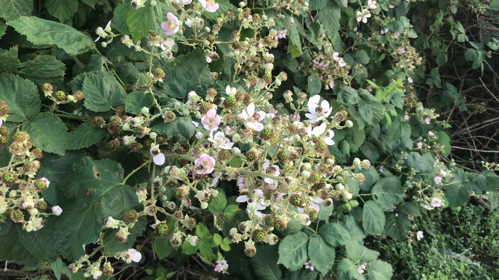
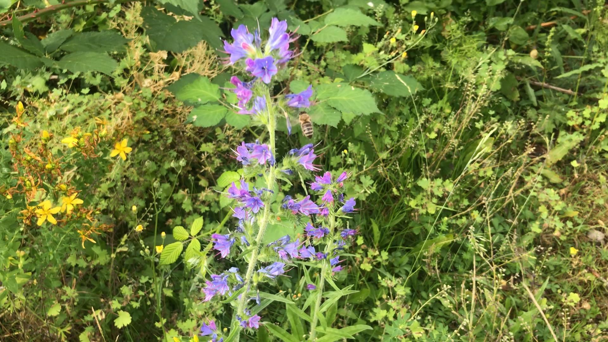
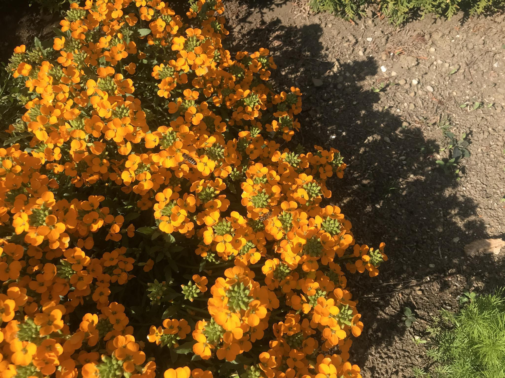
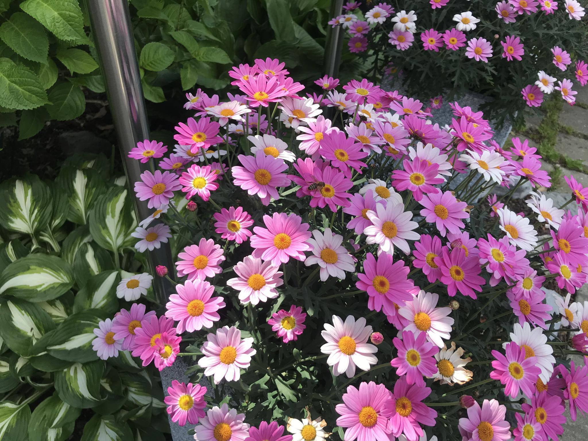

# BeeWatch

## Dataset

For the data collection different devices were used - a summary can be found in the table below.

| Device        | Camera/Resolution  |
| ------------- |:-------------:|
| Iphone 7      | 12 MP         |  
| x             | ....          |
| x             | ...           |

### Labeling
For the initial labeling the [VGG Image Annotator](http://www.robots.ox.ac.uk/~vgg/software/via/via-1.0.6.html) was used. With it's limited export functionalty we quickly ran into problems because we experimented with different models and frameworks which required different formats. This lead us to the holostic object detection platform [Roboflow](https://roboflow.com) which offers several export formats. 

The final Dataset consists of 1.814 images with 104 null examples. Each image has 1.1 annotations on average with results in 2.047 annotation overall with one class [bee]. Images are annotated with bounding boxes.

**Dataset**

| Image source  | count         |
| ------------- |:-------------:|
| [Malika Nisal Ratnayake et. al.](https://bridges.monash.edu/articles/dataset/Honeybee_video_tracking_data/12895433)| 436       |  
| own images    | 1398           

Images where eather taken as a single photo, or a video was taken and then deconstructed into single frames. To turn videos into single frames [FFmpeg](https://www.ffmpeg.org) was used. 
Images with various different backgrounds (flowers) are included - and selection of sample images can be seen below.

  
   
  

            |  
:-------------------------:|:-------------------------:
  |  
  |  

