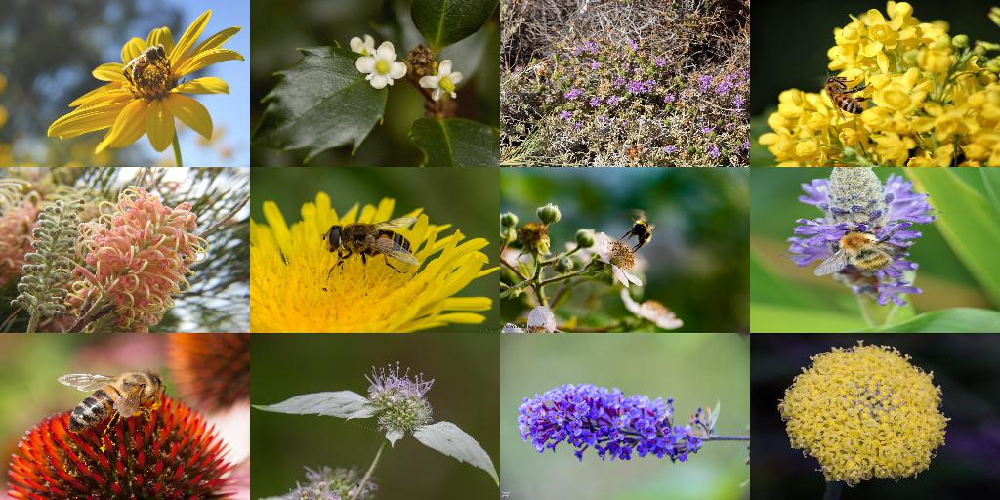

# BeeWatch

## Motivation

Insects such as bees, wasps, flies and beetles are the most important pollinators of wild and cultivated plants. From the 109 most important crops such as apples, strawberries, almonds, tomatos and melons,  about 80 % completely depend on the pollination of animals. [1] The total economic value generated by that is estimated to be around 153 billion euros per year worldwide. [2] Thinking of bees, wild bees are often underestimated in their importance when it comes to pollination. While the honeybee is ony responsible for at most one third of the pollination services, the remaining two third is done by wild bees and other wild pollinators such as the bumblebee. [3] However, entomologists have been oberserving a severe decline in the population of pollinating animals. [4]

[1] Klein, A. M., Vaissiere, B. E., Cane, J. H., Steffan-Dewenter, I., Cunningham, S. A., Kremen, C. & Tscharntke, T. (2007): Importance of pollinators in changing landscapes for world crops. Proceedings of the Royal Society B: Biological Sciences, 274, 303-313.  
[2] Gallai, N., Salles, J. M., Settele, J. & Vaissiere, B. E. (2009): Economic valuation of the vulnerability of world agriculture confronted with pollinator decline. Ecological Economy, 68, 810-821.  
[3] Breeze, T. D., Bailey, A. P., Balcombe, K. G. & Potts, S. G. (2011): Pollination services in the UK: How important are honeybees? Agriculture, Ecosystems & Environment, 142, 137-143.
[4] C. A. Hallmann, M. Sorg, E. Jongejans, H. Siepel, N. Hofland, H. Schwan, W. Stenmans, A. Müller, H. Sumser, T. Hörren, et al. More than 75 percent decline over 27 years in total flying insect biomass in protected areas. PloS one, 12(10):e0185809, 2017.

## Dataset

For the data collection different devices were used - a summary can be found in the table below.

| Device        | Camera/Resolution  |
| ------------- |:-------------:|
| Iphone 7      | 12 MP         |  
| x             | ....          |
| x             | ...           |

### Labeling
For the initial labeling the [VGG Image Annotator](http://www.robots.ox.ac.uk/~vgg/software/via/via-1.0.6.html) was used. With it's limited export functionalty we quickly ran into problems because we experimented with different models and frameworks which required different formats. This lead us to the holostic object detection platform [Roboflow](https://roboflow.com) which offers several export formats. 

The final Dataset consists of 1.814 images with 104 null examples. Each image has 1.1 annotations on average with results in 2.047 annotation overall with one class [bee]. Images are annotated with bounding boxes.

### Dataset

| Image source  | count         |
| ------------- |:-------------:|
| [Malika Nisal Ratnayake et. al.](https://bridges.monash.edu/articles/dataset/Honeybee_video_tracking_data/12895433)| 436       |  
| own images    | 1398           

Images where eather taken as a single photo, or a video was taken and then deconstructed into single frames. To turn videos into single frames [FFmpeg](https://www.ffmpeg.org) was used. 
Images with various different backgrounds (flowers) are included - and selection of sample images can be seen below.

  
   
  
  

### Mosaic dataset
The collected image footage is quite limited regarding the diversitiy of different flower types and colors. As the performance of computer vision applications primarly depend on the quality and especially the diversity of the training dataset, we decided to complement the collected data by a more comprehensive and diverse set of images. Therefore we picked the public image and video hosting platform [flickr](https://www.flickr.com) to do a structured search string query. Flickr is due to the extensive supply of word-tagged images from various domains a common and well-known tool for the creation of computer vision datasets. In order for us to comply with data privacy and protection guidelines, we only queried images listed under creative common licence. 
As the quality of the queried images heavily depend on the search string, we evaluated various keywords in advance. The search strings were iteratively evluated by a brief review of the responses and resulted in the following final search string: "bee flowers", "flowers" and "flower bushes". The latter were used for the [synthetic dataset generation](####Synthetic-dataset-generation) as background images.

After labeling bees in the downloaded datasets following the procedure presented in the [labeling section](###labeling) we used them to generate mosaic data. The mosaic augmentation is originally motivated in the YOLOv4 release and contributes significantly to its performance boost ([Bochkovskiy et al., 2020](literature/Bochkovskiy%20et%20al.%20(2020)%20-%20YOLOv4%20-%20Optimal%20Speed%20and%20Accuracy%20of%20Object%20Detection.pdf)). In order to scale down the queried bee images and benefit from the stated performance increase in model implementations beside YOLOv4/5 we generated 1000 mosaic images 3x4 and the corresponding new annotation files (see [mosaic_data_augmentation.ipynb](dataset/mosaic_data_augmentation.ipynb)). The probability of a bee image to be chosen for a individual mosaic tile was set to 0.3. The following shows an example mosaic image:

### Synthetic dataset generation

# Model

# References

