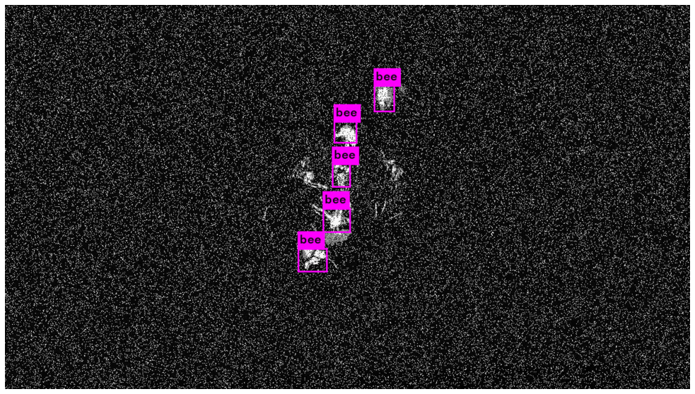
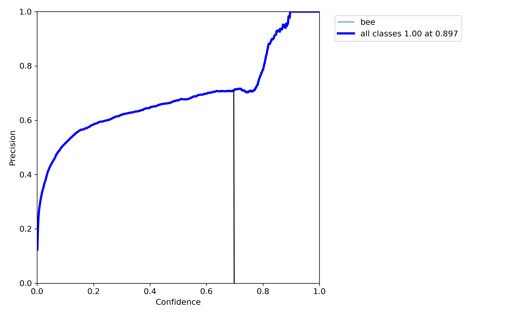

<!-- vscode-markdown-toc -->

# BeeWatch
* [Use Case](#UseCase)
	* [Motivation](#Motivation)
	* [Problem Statement](#ProblemStatement)
* [Data Gathering](#DataGathering)
	* [Labeling](#Labeling)
		* [Object detection labeling](#Objectdetectionlabeling)
		* [Object tracking labeling](#Objecttrackinglabeling)
	* [Additional data sources](#Additionaldatasources)
		* [Mosaic dataset](#Mosaicdataset)
		* [Synthetic dataset generation](#Syntheticdatasetgeneration)
	* [Resulting datasets](#Resultingdatasets)
* [Data Preprocessing](#DataPreprocessing)
	* [Final Dataset](#FinalDataset)
	* [Data Augmentation](#DataAugmentation)
* [Model building](#Modelbuilding)
	* [Model selection](#Modelselection)
	* [Background subtraction](#Backgroundsubtraction)
	* [Baseline with background subtraction and blob detection](#Baselinewithbackgroundsubtractionandblobdetection)
	* [Background subtraction + YOLOv4 tiny](#BackgroundsubtractionYOLOv4tiny)
	* [SSD (OLI)](#SSDOLI)
	* [YOLO](#YOLO)
	* [YOLOv4](#YOLOv4)
	* [YOLOv5](#YOLOv5)
		* [Why did we go with YOLOv5?](#WhydidwegowithYOLOv5)
* [Model Training](#ModelTraining)
 	* [Evaluation Metric](#EvaluationMetric)
	* [Training Environment](#TrainingEnvironment)
	* [Training Baseline](#BaselineModelTraining)
	* [Freezing Layers](#FreezingLayers)
	* [Adding Artificial Data](#AddingArtificialData)
	* [Added Data Augmentation](#AddedDataAugmentation)
	* [Hyperparameter Tuning](#HyperparameterTuning)
	* [Final Results](#FinalResults)
* [Deployment process](#Deploymentprocess)
* [Tracker - Centroid tracker](#Tracker)
* [Hybrid and other methods for detection](#Hybrid)
 	* [Blob detection with object detection as a corrector](#BlobCorr) 
	* [Blob detection and object detection](#BlobAnd) 
	* [Comparing the methods](#Compar)
* [Flask - Frontend](#Flask)
	* [Integration of the camera and real life deployment](#Camera)
* [Extra - Case](#Extra-Case)

<!-- vscode-markdown-toc-config
	numbering=false
	autoSave=true
	/vscode-markdown-toc-config -->
<!-- /vscode-markdown-toc -->


## <a name='UseCase'></a>Use Case
### <a name='Motivation'></a>Motivation
(Christin Scheib)  
Insects such as bees, wasps, flies and beetles are the most important pollinators of wild and cultivated plants. From the 109 most important crops such as apples, strawberries, almonds, tomatos and melons,  about 80 % completely depend on the pollination of animals. [1] The total economic value generated by that is estimated to be around 153 billion euros per year worldwide. [2] Thinking of bees, wild bees are often underestimated in their importance when it comes to pollination. While the honey bee is only responsible for at most one third of the pollination services, the remaining two third is done by wild bees and other wild pollinators such as the bumblebee. [3] However, entomologists worldwide have been oberserving a severe decline in the population of pollinating animals. Mostly affected by this are honey bees as well as wild bees. [4] As the global agriculture sector depends on the pollination of insects the global decline is a severe threat for our ecosystem and the industries. [5] In order to counteract on this trend it is imperative to understand the root causes. Several contribution factors such as harmful pesticides, parasites, diseases, malnutrition, intruders, urbanisation and intensive monoculture cultivation have been found to lead to this global decline. [6, 7, 8, 9, 10] As these are only a subset of all the contributing factors it is hard to understand what caused a local rise in the bee mortality. 

(Aleksandar Ilievski)  
One way of gaining insights and understanding the local causes for the rise in bee mortality are bee monitoring approaches. Wild bees are particularly well suited for monitoring approaches because they are great bioindicators. Reason for this is their sensitivity to changes in their habitats. Since wild bee species are often highly specialized to particular nesting sites and food resources they are negatively impacted by anthropogenically caused degradations in their habitats. They also have a small activity range which increases their dependency on spatial availability of nesting and food resources.[11] There are around 750 different species of wild bees in Central Europe, and they have an average operating radius of around 100-300 meters but can go up to 1500 meters at maximum.[12][13] Wild bees often nest in cavities for example in the ground, in dead wood or even holes in walls. Around 35 percent of bees in Central Europe are specialized to collect pollen only from particular plants. This means, that changes in local landscapes such as the loss of non-cropped areas used as nesting sites for wild bees as well as the lack of flowering plants negatively impacts reproduction of bees. Therefore, the long-term monitoring of changes in wild bee communities can help discover local causes for bee mortality and help the conservation of their habitats.[11]

Bee monitoring is not a new concept. In fact, the idea dates back to 1935 and has since been used to show how anthropologically caused changes in the environment impact pollination relevant insects as well as help pass important environmental-friendly regulations.[14][15] There are two main challenges when monitoring wild bees: first, in contrats to honeybees, they don’t live in big colonies. Thus, they can’t be found and monitored at one place i.e. inside a bee hive. Second, identifying and classifying wild bee species is difficult due to their small size, rapid movement and general difficulty to distinguish the different species. Observational monitoring at the site is usually not accurate enough to distinguish wild bee species. Instead, specialized researches are needed to collect wild bee samples and identify them for example in laboratories.[16] This makes the monitoring process of wild bee communities a complex task. In the following, some of the traditional wild bee monitoring approaches will be described. One method is the collection of bee samples using insect nets. This usually requires search for the bees at nesting sites or forage plants. Another way of collecting bee samples is the use of pan traps. This type of trap is a pan or bowl filled with a conserving liquid and is usually designed with bright colors such as yellow, white and blue as well as UV-reflective surfaces to attract bees. Fortel et. al. used pan traps and insect nets in their bee monitoring with the goal to analyze the impact of urbanization on wild bee diversity. In their effort they captured 291 wild bee species at 24 sites with different urbanization levels. Their research showed that there were fewer individuals in sites with higher levels of urbanization.[17] Lastly, another classic bee monitoring approach is the use of malaise traps. This trap has a tent-like structure and is made of fine netting. Once the bees fly into the dark netting, they will fly up towards the light where there is a jar filled with ethanol that catches, kills and preserves the bee. Hallmann et. al. used malaise traps to measure the change in total insect biomass over 27 years in 63 nature protection areas in Germany. The result was a decline of 76% in total aerial insect biomass matching the reported parallel decline in wild bees suggesting that it is not only the vulnerable species, but the flying insect community as a whole, that has been affected over the last decades.[18] 

There are multiple issues with these traditional types of bee monitoring approaches. They require extensive manpower, are very time consuming and usually come with sample size problems. Collecting bee samples and identifying them in a laboratory takes time and specialists who can distinguish the different species.[19] Particularly active collecting methods such as directly observing or catching insects using insect nets is very time-consuming and can be unreliable since the quality of the results depend on the abilities of the observer. [20] Pan traps can be an alternative but usually perform poorly due to their passive approach.[17] They also have no evidence that the caught insect visits or pollinates flowers. Identifying the different type of species in a laboratory leads also to the killing of the animal. [20] There have been newer approaches which utilize modern technologies to accelerate the monitoring process such as RFID tags.[21] Manually tagging bees, however, is also very time-consuming and it is difficult to ensure that the tags won’t harm the bees or restrict their motion.[22] 

Since these bee monitoring methods are very intrusive, harm individual bees and require high effort, less invasive and more efficient methods are required. One solution is the use of machine learning methods. Computer vision models can be used as an alternative to the more traditional monitoring approaches. There are multiple advantages to this approach: first, this approach is less intrusive because it does not require anthropogenic intrusion, trapping and potentially harming or killing the animal. Second, there is less bias in the results compared to specialists actively monitoring or catching wild bees in the field. Additionally, having video footage preserve the observations. Thanks to machine learning algorithms, these footages will be processed automatically, making this a very efficient approach. There are existing papers that have already implemented computer vision methods in similar use cases using approaches such as foreground/background subtraction[23][24][25] and convolutional neural networks[26][27]. Ratnayake, M. N., Dyer, A. G., & Dorin, A. (2021) have used a combination of a YOLOv2 network and background subtraction to implement a bee tracking system at the pollination site. The YOLOv2 model initializes the tracking process by identifying the bee’s first appearance. Afterwards, the background subtraction algorithm tracks the insect. If there is too much noise due to high background movement, the algorithm switches back to the YOLOv2 model, making this a hybrid approach. Their implementation tracks one insect at a time from its entry to its video exit. In order to track multiple insects, they have to preprocess the videos which can be labor intensive [28]. An updated approach to this is presented in Ratnayake, M. N. (2021) which provides a more efficient multi-insect tracking solution.[20] 

Since bees are powerful bioindicators, a bee tracking system could be of interest for a broad base of potential customers, such as the manufacturing industry for monitoring the effects of air and soil pollution, farmers for monitoring and regulating the effects of pesticide usage or regulatory and research institutions for monitoring biodiversity in regions, supporting research projects and passing regulations in case of violations.

### <a name='ProblemStatement'></a>Problem Statement

(Andrea Bartos)

Our goal is to built a real-time bee detector to track individual bees at the site of pollination in order to quantify activity.

In order to be able to derive specific information about individual species, a distinction would be valuable. However, since the differentiation requires experts, this is outside of the scope of this project and remains part of future research. 


## <a name='DataGathering'></a>Data Gathering
(Aleksandar Ilievski)  
For the data collection process, pictures and videos were taken of bees using different devices. A summary of the devices that were used can be found in the table below. The data collection process proved to be difficult for a multitude of reasons. First, bee activity is highly dependent on the weather. Since the project started in the end of April, the weather in Karlsruhe was very rainy. In May, Karlsruhe had 22 rainy days and in June there were 17.[29] This meant that there was quite a short time frame for data collection. Both pictures and videos were collected. During the first data collection round there was also a lot of wind which caused movement of plants in the videos. This is particularly problematic for the usage of background subtraction, since it creates a lot of noise in the footage (see Background subtraction + Tiny YOLO). In general, collecting data outside can be difficult because the quality of data is also impacted by sunlight exposure which is something the model needs to be robust again and thus, proving this use case to be quite complex. Second, it is challenging to take pictures of living insects as they are very small and move fast. When there was wind, the bees tended to move even more rapidly. Therefore, taking a clear picture from an acceptable distance took some practice in the beginning. 

| Device        | Camera/Resolution  |
| ------------- |:-------------:|
| GoPro         | 720 with30 fps| 
| iPhone 8      | 12 MP         |  
| iPhone 7      | 12 MP         |  
| iPhone 11 Pro | 12 MP         |
| iPhone 12 Pro | 12 MP         |


In total we managed to collect 2400 bee images. 

| Image source  | count         |
| ------------- |:-------------:|
| own images    | 2.400           

Exemplary images can be found below 

<p align="center">
  
  
  
  
</p>


### <a name='Labeling'></a>Labeling 
#### <a name='Objectdetectionlabeling'></a>Object detection labeling
(David Blumenthal)
Images where either taken as a single photo, or a video was taken and then deconstructed into single frames. To turn videos into single frames [FFmpeg](https://www.ffmpeg.org) was used. Images with various different backgrounds (flowers) are included - and selection of sample images can be seen below.
For the initial labeling the [VGG Image Annotator](http://www.robots.ox.ac.uk/~vgg/software/via/via-1.0.6.html) was used. 
In order to distribute the effort and to work efficiently, we decided that everyone should label the images they had taken themselves and then later merge them into a single data set. This quickly led to problems when merging, as e.g. label names were assigned differently or not at all. The limited export functionality (its own format, which is not common and Coco json format where we had problems exporting) required us to develop and search for functions, which allowed us convert from one dataformat into others. This was necessary because at the beginning we compared different models from different frameworks, each of which required different data formats.
This made us switch to another editor, because we experimented with different models and frameworks and therefore required different formats. 
This lead us to the holistic object detection platform [Roboflow](https://roboflow.com) which offers several export formats. 
Overall we manually labeled around 2.400 images of with 104 were null examples.
On average each image has 1.1 annotations which results in 2.640 annotations overall distributed among one class [bee]. The images were annoteded with bounding boxes.

#### <a name='Objecttrackinglabeling'></a>Object tracking labeling
(Maximilian Nitsche)

The primary technical objective of the use case is to quantify bee activity. Therefore, we are of course interested to track bees along a video-stream and to not double count a bee across frames as the model would otherwise overestimate the activity. Simple object detection labeling, i.e. drawing bounding boxes around individual bees, is therefore not sufficient to evaluate the overall use case. Detecting bees completely, i.e. without cutting off the wing for example, is therefore only of secondary importance. In order to test and evaluate our model and especially the tracking methods also on image sequences, we searched for a labeling tool where one can assign IDs across the individual frames in addition to drawing bounding boxes around objects. 


It turned out that this functionality is quite rare to never part of well known and common labeling tools. Therefore, we used the service [Amazon Sage Maker - Ground Truth](https://aws.amazon.com/de/sagemaker/groundtruth/), which included the free of charge labeling of 500 initial frames. We first had to provide the video frames to the service via an Amazon S3 storage bucket. Secondly, a labeling job and private workforce had to be created and assigned as the service is usually utilized to outsource labeling jobs to Amazon Mechanical Turk. 

Unfortunately, the tool did not support a standard label format, such as YOLO or Pascal VOC or similar, so we had to [convert](dataset/json_to_AWS_ground_truth.ipynb) existing labels into the appropriate JSON format by a short script. However, Amazon Sage Maker Ground Truth allowed us to predict bounding boxes of the next frame based on the current ones. This active learning approach therefore simplified labeling significantly. An exemplary labeled frame can be found below.


The resulting labels are later on used by the Flask interface to visually evaluate various tracking approaches regarding their over- or underestimation of bee activity within a given timespan.

### <a name='Additionaldatasources'></a>Additional data sources
(Maximilian Nitsche)

The collected image footage is quite limited regarding the diversitiy of different flower types and colors. As the performance of computer vision applications primarly depend on the quality ("Garbage in, garbage out") and especially the diversity of the training dataset, we decided to complement the collected data by a more comprehensive and diverse set of images from various other openly accessible sources. Searching online, we found a labeld bee dataset from researchers of the Monash University.  However as this training set only offers images with two different background flowers, we were only able to use a limited number of images so that the model would not specialise on these specific backgrounds. In order to collect another 1000 bee images we picked the public image and video hosting platform [flickr](https://www.flickr.com) to do a structured search string query. Flickr is due to the extensive supply of word-tagged images from various domains a common and well-known tool for the creation of computer vision datasets. In order for us to comply with data privacy and protection guidelines, we only queried images listed under creative common licence. As the quality of the queried images heavily depend on the search string, we evaluated various keywords in advance. The search strings were iteratively evluated by a brief review of the responses and resulted in the following final search string: "bee flowers", "flowers" and "flower bushes".

We first [downloaded](dataset/flickr_dataset_collection.ipynb) and [labeled](###Labeling) an additional batch of 1000 bee images and two videos, which were seperated into individual frames. Moreover, we downloaded 1000 images of flowers or bushes without any bees as these are especially usefull as null images and were used for the proceeding synthetic data generation as background images (see [Synthetic dataset generation](####Synthetic-dataset-generation)).


#### <a name='Mosaicdataset'></a>Mosaic dataset 
(Maximilian Nitsche)

After labeling bees in the downloaded datasets following the procedure presented in the [labeling section](###labeling) we used them to generate mosaic data. The mosaic augmentation is originally motivated in the YOLOv4 release and contributes significantly to its performance boost ([Bochkovskiy et al., 2020](literature/Bochkovskiy%20et%20al.%20(2020)%20-%20YOLOv4:%20Optimal%20Speed%20and%20Accuracy%20of%20Object%20Detection.pdf)). As the downloaded images often show only individual bees on one flower the mosaic augmentation also makes sure the data meets our use case requirements to detect bees from further distance. In order to scale down the queried bees and benefit from the stated performance increase in model implementations beside YOLOv4/5 we [generated](dataset/mosaic_data_augmentation.ipynb) 3x4 mosaic images and the corresponding new annotation files. The probability of a bee image to be chosen for a individual mosaic tile was set to 0.3. The following shows an example mosaic image:


#### <a name='Syntheticdatasetgeneration'></a>Synthetic dataset generation 
(Andrea Bartos)

As mentioned previously, the collection of our real-word bee data was hindered by rainy weather. Therefore, we encountered a commonly occurring problem in AI, namely the lack of sufficient data. One way to compensate for this obstacle is to generate synthetic data. The idea behind synthetic data is to mimic real-world scenarios. The advantage of this method is its ability to create rapidly labeled data in large quantities at minimal cost and effort. However, a key challenge in creating synthetic data is how well a model can generalize what it learns from them to real-world scenarios. [30]

For our case, the usage of this approach has two main purposes. The first is to be able to gather training data without being dependent on unswayable factors like the weather. The other is to be able to generalize on a wide range of different flowers. The pollination times of different flowers differ. Therefore, with the given time frame, the ability to generate real world training data consisting of a wide range of flowers was limited. 

The source data for the generation consists of the flower bush set obtained from [flickr](https://www.flickr.com)  comprising 1000 images and 14 images of bees from different perspectives with a transparent background. 

A synthetic image is created by drawing a random background from the flower bed data set and pasting a random number of bees on the background. The pasted bees vary in size, position and rotation. Moreover, additional enhancements are performed on bee images with a certain probability before being pasted on the background (blurring and filtering from PIL library). The corresponding bounding boxes are saved as XML annotation files in Pascal VOC format.

Although the synthetic data are not a perfect representation of the real world, they improve the generalization ability of our model, as will be shown in the later training, compared to models that were only trained on real data. 
Exemplary representations of the synthetically generated data can be found below.

<p align="center">
  
   
  
  
</p>

### <a name='Resultingdatasets'></a>Resulting datasets 
(Maximilian Nitsche) The resulting additional datasets are listed below. 

| Image source  | No. of images  |  No. of labels | No. of null images |
| ------------- | ------------- | ------------- | ------------- |
| Flickr - (Mosaic) images| 1000  |  1034 | 0
| Flickr - Video frames | 741 (360 + 381) |  2398 | 167 
| Synthetic images  | 1000     | 7801 | 0
| [Malika Nisal Ratnayake et. al.](https://bridges.monash.edu/articles/dataset/Honeybee_video_tracking_data/12895433)| 436       |  ? |  ? 


## <a name='DataPreprocessing'></a>Data Preprocessing
(David Blumenthal)
To guarantee a uniform data format, the different image formats (png, jpg, etc.) were converted to .jpg using OpenCV. The quality was set to 90 to reduce the file size and at the same time maintain sufficient quality.
In the first trials, we did not succeed in achieving good results for various reasons. One of the reasons was that the variance in the backgrounds (flowers) was still to low, but in the validation set flowers, of which there were few or none in the training data set managed to make up the majority. In further attempts to build the dataset, the images were better distributed across the splits, which meant that the results were suddenly very good. The reason for this was that the majority of the images consisted of videos. From these, consecutive frames - which did not differ much - ended up in the training and validation dataset. This in turn led to the model having very good metrics, but not performing (generalising) well on a test video. The same problem occurred both with rather large bees in test and small ones in val or vice versa. It took several iterations before a balanced data set emerged from the above problems. It took several iterations before a balanced data set emerged from the above problems. 
The resulting dataset only has frames that are associated with completed videos in train, val and test. This has led to a split that is not necessarily common, with the training data here appearing lower, as everything was created in a back and forth process with artificial data beeing added ontop of the training split. 
Training - 0.65 Validation - 0.32 Test 0.03
<p float="center">
   
</p>

### <a name='FinalDataset'></a>Final Dataset 

David?

### <a name='DataAugmentation'></a>Data Augmentation
(Andrea Bartos)

Data augmentation is a method that allows to significantly increase the variety of data for the training of models without having to acquire additional new data. New training instances are created by performing transformation on already existing instances thus providing new situations and perspectives for model training. That way it can alleviate the problem of overfitting. Essential when performing augmentation in object detection tasks is, that the transformation is not only performed on the image itself but also on the bounding box defining an object’s position. There are several available libraries which provide a wide range of augmentation techniques. Such a library is [imgaug](https://imgaug.readthedocs.io/en/latest/index.html). 
However, the wide range of augmentation techniques should not be applied thoughtlessly to the data. The choice of suitable techniques depends on the use case. 

There are two options on how to perform augmentation, depending on the algorithm used. On the one hand, data augmentation can be applied as part of preprocessing. With new algorithms like YOLOv4, YOLOv5 and YOLOR an integrated augmentation at runtime is possible. The advantage of integrated (at run time) augmentation is the avoidance of intensive I/O workloads. On the other hand, certain functionalities that libraries like imgauge offer are not available as run-time augmentation techniques. Before we started experimenting with data augmentation, we have already decided on using YOLOv5 as our training model. Furthermore, at that point we were already struggling with storage capacities in Google Drive where we stored all data sets in order to make it easily accessible for everyone.  For this reason, we decided to perform augmentation at run time.

The YOLOv5 [implementation](https://github.com/ultralytics/yolov5/blob/master/data/hyps/hyp.scratch.yaml) by  Glenn Jocher offers the following data augmentation techniques with the following default parameters.

``` yaml
hsv_h: 0.015  # image HSV-Hue augmentation (fraction)
hsv_s: 0.7  # image HSV-Saturation augmentation (fraction)
hsv_v: 0.4  # image HSV-Value augmentation (fraction)
degrees: 0.0  # image rotation (+/- deg)
translate: 0.1  # image translation (+/- fraction)
scale: 0.5  # image scale (+/- gain)
shear: 0.0  # image shear (+/- deg)
perspective: 0.0  # image perspective (+/- fraction), range 0-0.001
flipud: 0.0  # image flip up-down (probability)
fliplr: 0.5  # image flip left-right (probability)
mosaic: 1.0  # image mosaic (probability)
mixup: 0.0  # image mixup (probability)
``` 


With our use case in mind, we adapted the applied data augmentation in the YOLOv5 framework as follows. These parameters are determined in the file  yolov5/data/hyps/hyp.scratch.yaml


``` yaml
hsv_h: 0.1  -> increased
hsv_s: 0.7  -> relevant, kept default value
hsv_v: 0.4  -> relevant, kept default value
degrees: 0.3  -> increase, because the orientation from camera to bees can be quite varied
translate: 0.3  -> increase, since bees can be located anywhere in the picture
scale: 0.5  -> relevant therefore kept default value
shear: 0.0  
perspective: 0.0 -> seemed to make sense because the orientation from camera to bees can be quite varied. After trying we came to realise that it doesnt produce useful images, therefore kept @ 0.0
flipud: 0.25  -> increase, depending on perspective, the bee can be upside down
fliplr: 0.5  -> relevant, kept default value
mosaic: 1.0  -> relevant, kept default value
mixup: 0.0  
Copy_paste: 0.0  -> only available for segment labels not bounding boxes; therefore not changed
``` 


## <a name='Modelbuilding'></a>Model building

### <a name='Modelselection'></a>Model selection
(Andrea Bartos)

To solve the task of object detection there are generally two available approaches, namely one-stage and two-stage detection algorithms. When performing object detection, there are two tasks that need to be solved. For one, object localization and for the other the task of object classification. In two-stage algorithms, such as R-CNN, Fast R-CNN, Faster R-CNN, these tasks are performed separately. In one-stage detection algorithms, such as YOLO, object classification and localization are performed in a single pass. This has the advantage that these algorithms are usually faster than two-stage detectors, but under the trade off that they are less accurate. With respect to our goal of real-time object detection of bees with a deployed model on the Jetson Nano, inference speed plays a major role. Among the two-stage detection algorithms, only the Faster R-CNN is suitable as an algorithm, which can be derived from the following diagram.[31] 

<p align="center">
  
</p>

However, since fast inference is key when it comes to real-time detection, thus to our use case, we decided to place our focus on one stage detection algorithms as they tend to fulfill this property. Therefore, we were searching for models with low inference time (ms) and therefore a high score of FPS and high mAP. Furthermore, since the storage capacity is limited on the jetson nano, the size of these models is also taken into consideration.

Looking at the following diagrams and [TensorFlow 2 Detection Model Zoo](https://github.com/tensorflow/models/blob/master/research/object_detection/g3doc/tf2_detection_zoo.md) while considering our decision criteria, we decided to look into the following models: YOLOtiny, YOLOv5, SSD

<p align="center">
   
</p>
sourced from https://developer.nvidia.com/embedded/jetson-nano-dl-inference-benchmarks

<p align="center">
   
  
</p>
sourced from https://arxiv.org/pdf/2004.10934.pdf and https://blog.roboflow.com/yolov5-is-here/

### <a name='Backgroundsubtraction'></a>Background subtraction
(Maximilian Nitsche)

First of all we experimented with various background subtraction techniques as we are trying to detect moving and flying objects on relatively static backgrounds like flowers or bushes. 

A common background subtraction technique is MOG which is a gaussian mixture-based background segmentation algorithm. The underlying assumption is that each pixel is derived from a mixture of K Gaussian distributions. The corresponding weight of the modeled mixture is the timespan that those colors were present in the video so far. Static background colors are therefore identified by higher weights. MOG2, which is an enhancement of MOG, is able to dynamically find the number of underlying gaussian distributuions by itself depending on the given scene. You can find a short implementation clip of the MOG2 on a recorded flower below.  


The most important parameter of MOG2 is the kernel size which controls the sensitivity of the applied subtraction regarding minor background differences (here the kernel size is set to 2x2). The appropiate best kernel size depends on the distance and steadyness of the background and hence must be fine tuned on the given situation. 

### <a name='Baselinewithbackgroundsubtractionandblobdetection'></a>Baseline with background subtraction and blob detection
(Aleks)

### <a name='BackgroundsubtractionYOLOv4tiny'></a>Background subtraction + YOLOv4 tiny 
(Maximilian Nitsche)

During the labeling process we noticed ourselves that bees are much easier to localize by the human eye if you face a series of frames and see the differences between frames instead of each frame individually. As CNNs themselves are somewhat motivated by the biological eye, we tried to transfer this finding to an initial model. Blob detection is only performing on background subtraction in very calm situations without much movement of the background i.e. the flower or bush itself. Therefore the motivation of feeding a CNN with background subtraction frames is also that the model learns to ignore flower borders or noise and is able to detect bees based on their outline (see the exemplary image below).


We first [split](tracking/video_splitter.py) the videos and labeled the resulting frames. Afterwards we used the orginal video footage and the splitter again to split the videos into the same frames but this time we applied background subtraction in advance.

Since background subtraction can become very slow in cases of a lot of movement and as it is already a data reduction technique we decided that a more shallow but faster model version of YOLO would be sufficient. Hence, we trained a YOLOv4 tiny on the given dataset. YOLOv4 tiny has a very similar architecture as the common YOLOv4 model but - as the name suggests - the network size is significantly compressed to ensure faster inference in acceptance of a lower prediction accuracy by reducing the number of convolutional layers in the CSP backbone (see [YOLOv4](###YOLOv4) for more details)


In order for us to train a robust CNN-model we run the frames through a pipeline of augmentations to double the dataset size. In addition to the usual background subtraction, the following augmentation techniques were incorporated into the dataset to increase the model robustness and the diversity of the frames. 

``` yaml
Outputs per training example: 2 -> double the training size
Flip: Horizontal, Vertical 
Crop: 0% Minimum Zoom, 25% Maximum Zoom
Shear: ±15° Horizontal, ±15° Vertical
Noise: Up to 15% of pixels <- relevant to simulate additional noise
``` 

The results of the hybrid approach first seemed to be very promising as the YOLOv4 tiny model were able to detect even partly occluded bees and also ignore noise generated by a moving background. However, the performance again only applied to a certain degree of noise caused by background movement and heavily depend on the scene setting (as can be seen below). 

<p float="center">
  
   
</p>

Therefore, the hybrid approach of background subtraction together with a more simplistic detection model like blob dection or shallow CNNs is utilized by the system in very calm situations. The full details of how we make use of the combination can be found in the [tracking section](#Tracker).

### <a name='SSDOLI'></a>SSD (OLI)

### <a name='YOLO'></a>YOLO
(David Blumenthal)

Yolo has been first introduced in 2016 and set a milestone in object detection research due its capability to detect object in real-time with better accuracy.
It was first introduced by Joseph Redmon and developed further by him up to YOLOv3. The versions were implemented in the Darknet framework. Later the v3 Version was also implemented in PyTorch by Glenn Jocher of Ultralytics LLC who as we will later see is also responsible for the controversially discussed YOLOv5. [https://towardsdatascience.com/yolo-v4-or-yolo-v5-or-pp-yolo-dad8e40f7109](https://towardsdatascience.com/yolo-v4-or-yolo-v5-or-pp-yolo-dad8e40f7109)
Joseph Redmon, the initiator of YOLO, announced in the spring of 2020 that he has stopped his research in computer vision due to several concerns regarding military applications and privacy concerns. [His tweet](https://twitter.com/pjreddie/status/1230524770350817280) 

### <a name='YOLOv4'></a>YOLOv4
However this was not the end YOLO. In April 2020 **Alexey Bochkovsky et al.** introduced YOLOv4 in a paper titled: [YOLOv4: Optimal Speed and Accuracy of Object Detection](https://arxiv.org/abs/2004.10934). 
To improve performance the authors introduced different methods to improve the models performance. These methods can be devided into two categories:
**Bag of freebies (BoF)** and **Bag of specials (BoS)**. BoF are methods that increase object detectors performance without increasing the inference cost. These methods only change the training strategy or in other words only increase the training costs. An example would be data augmentation techniques. In contrast to the Bof, bag of specials are methods that increase inference costs in order to achieve better accuracy in object detection. The trade off however is vastly in favour of accuracy as the inference cost is rather small in comparison to the achieved accuracy boost. These modules try to enhace certain attributes in a modules receptive field or strengthening feature integration capability, etc.
**YOLOv4** consists of:

🦴  | Backbone: CSP Darknet53

⚱️  | Neck: SPP, PAN

🗣️  | Head: YOLOv3

YOLOv4 gets its improvements through a selection and implementations of different BoF-methods like CutMix and Mosaic data augmentation, CIoU-loss, Optimal hyperameters (evolution) etc. and for BoS-methods mish activation and using multiple anchors for a single ground truth are used. Just to name a few - a full list and explanation can be found in the released paper. ([Bochkovskiy et al., 2020](literature/Bochkovskiy%20et%20al.%20(2020)%20-%20YOLOv4:%20Optimal%20Speed%20and%20Accuracy%20of%20Object%20Detection.pdf))
### <a name='YOLOv5'></a>YOLOv5
(David Blumenthal)

Like already mentioned only two months after the initial of YOLOv4, YOLOv5 was published by Glenn Jocher. 
YOLOv5 differs most from all other releases because this is a PyTorch implementation rather than a fork from the original Darknet. Same as the v4 version it implements the **CSP backbone**, the **PANet** as neck and the same head as **v3 and v4**. YOLOv5 has a total of 4 versions which mainly differ in number of parameters and layers. 

The exact architecture of v5s model can be found [here](https://gist.github.com/mihir135/2e5113265515450c8da934e15d97fc6b).
#### <a name='WhydidwegowithYOLOv5'></a>Why did we go with YOLOv5?
One huge advantage is model size in mb. The smallest versions weights (yolov5s) only take up 13.7 MB of space. In addition, it benefited from a very large community of users, which meant that it was under active development with improvements being made on a weekly basis.
**ToDo**


## <a name='ModelTraining'></a>Model Training

### <a name='EvaluationMetric'></a>Evaluation Metric
 (Andrea Bartos)

While researching possible evaluation metrics, we quickly came to realize that there are many variations to the two numerical metrics average precision (AP) and average recall (AR). AP can be defined as the area under the interpolated precision-recall curve.  AR is the recall averaged over all IoU ∈ [0.5,1.0].
Mean average precision (mAP) is defined as the mean of AP across all K classes. Accordingly, Mean average recall (mAR) is defined as the mean of AR across all 
K classes. According to literature, Pascal VOC Challenge's mAP is considered the standard metric for evaluating the performance of object detectors, which is identical to COCO's mAP @ IoU=.50. [32] 
With our use case in mind, we decided to adopt average precision at IoU=0.5 as the evaluation metric for our model. Our goal is to be able to quantify the number of bees within a given time period. To fulfill this objective, the bounding box does not necessarily have to perfectly match the ground truth. For this reason, we decided to keep the IoU at 0.5 and not set a higher threshold. Since there is only one class (K=1), the two metrics mAP and AP are equivalent in our case.

### <a name='TrainingEnviornment'></a>Training Environment
(David Blumenthal)

Google Colaboratory was used as the training environment. Colab is a Google environment that allows Python code to be written and executed in the browser. This gives one simple, fast and free access to GPUs. Of course, there are also some disadvantages. The time that can be used in a session is limited, which means that training sessions that exceed a certain limit are aborted. In addition, a permanent connection in the browser is necessary. Here, too, there were problems because the connection often breaks down, which leads to the training being interrupted. This makes overnight training particularly difficult and we found that a fair amount of luck is needed for a session to run smoothly overnight. 

### <a name='BaselineModelTraining'></a> Training Baseline
To establish a baseline performance we trained the YOLOv5s - which is the smallest model of the YOLOv5 - on real images, meaning we didn't use any of the artificial data. All of the hyperparameter were left on default settings.


### <a name='FreezingLayers'></a>Freezing Layers 
(Andrea Bartos)

Throughout the process of model training, we quickly learned that it is a lot of trial and error. One main hurdle is the long training time before one can actually tell whether the given modification improves performance or not. Hence, we decided to leverage transfer learning to speed up the training time and thus have more time to train different configurations. Looking at Glenn Jocher's [implementation and results](https://github.com/ultralytics/yolov5/issues/1314), this approach seems promising. By freezing the backbone of YOLOv5 (layers 0-9), the performance was slightly lower, but the training time was significantly reduced. 

Unfortunately, we experienced a different result. The training time was reduced significantly, yet the performance also decreased substantially, which is why we discarded this approach.

| Training                     | Pval  | Rval  | mAP@0.5val | Ptest | Rtest | mAP@0.5test | Training time|
|------------------------------|-------|-------|------------|-------|-------|-------------||-------------|
| without freezing layers     | ?  | ? |    ?   |  |  ?|   ?    ||
| with freezing backbone | ? | ? |    ?   | ? | ? |    ?    | |

### <a name='AddingArtificialData'></a>Adding Artificial Data 
(David Blumenthal)

In the process of further improving the models performance we tried multiple runs  with adding increasing portions of the artificial data as described in section **Dataset**. Synthetic data is a great way to expand the dataset in a cost-effective way. It allows to overcome restrictions when real data is costly or not available at all.  
The generation of synthetic data may seem like a way to produce unlimited amounts of training data. While there might be some truth to this, we found that generating data that mimics real world conditions is rather challenging.
However data's effectiveness is best measured when in use, so we tried multiple runs with adding increasing portions of 
artificial data to the training set. Starting at 100 images (which adds up to 5% of training set) moving up to 450 images (19.5%). 
We found, that adding data the models' performance increased noticeably up to about 500 images. After that, the performace tended to decrease again on the validation set. This may be because the model learns features that the synthetic data brings, but which are not typical for the real world.
However, the limited number of artificial images in the training set led to a significant increase in the model as can be seen in table below. While Precision remained on a rather similar level we saw that Recall moved up - with a minor improvement on the validation set but a rather significant increase on the test set.

<p float="center">
  
   
</p>


| Training                     | Pval  | Rval  | mAP@0.5val | Ptest | Rtest | mAP@0.5test |
|------------------------------|-------|-------|------------|-------|-------|-------------|
| without artificial data (baseline)      |  0,75 | 0,546 |    0,574   | 0,544 |  0,43 |    0,449    |
| with artificial data (19.5%) | 0,741 | 0,597 |    0,626   | 0,805 | 0,767 |    0,763    |
| modified fitness function    | 0,721 | 0,563 |    0,595   | 0,768 | 0,616 |    0,668    |

### <a name='AddedDataAugmentation'></a>Added Data Augmentation
(Andrea Bartos)

So far, all training has been done with the default augmentation values. As described in Data Augmentation, the appropriate augmentation techniques strongly depend on the use case. For this reason, we see potential to improve performance even further by applying techniques relevant to our use case. The changed parameters can also be found in Data Augmentation.

The performance after 300 epochs is as follows. Compared to the performance without customized data augmentation, the result is similar but marginally inferior. Since the difference is so small, this may also be due to the random initialization of the weights at the beginning of the training. 

| Training                                                     | Pval  | Rval  | mAP@0.5val | Ptest | Rtest | mAP@0.5test |
|--------------------------------------------------------------|-------|-------|------------|-------|-------|-------------|
| with artificial data (19.5%) & adjusted run-time augmentation| 0.789 | 0.524 |    0.608  |  0.769 | 0.697  |    0.739  |           
---------------------------------------------------------------------------------------------------------------------------


            

Exemplary training images will look as follows:

<p align="center">
   
</p>


### <a name='HyperparameterTuning'></a>Hyperparameter Tuning
(David Blumenthal)

Apart from perfecting the training dataset, hyperparameter tuning can be used to increase the models performance. YOLOv5 offers 25 hyperparameters including those with regard to test time augmentation. The YOLOv5 implementation offers functionality that can support in finding good hyperparameters.
With Google Colab as our training environnement computing resources - especially time - is very limited, hence we had to work to with assumptions. First we defined a base scenario from which we wanted to approve. The base scenario was a standard YOLOv5s model with pretrained weights on the COCO dataset which we trained for 10 epochs. With the "evolve" function the model tries to find better parameters using a genetic algorithm with the main operators crossover and mutation with a 90% probability and 0.04 variance. [Github Yolov5](https://github.com/ultralytics/yolov5/issues/607)
We did that for 50 iterations. We assumed that after 10 epochs good parameters would be found and would be also beneficial in a full training.  


| Training                      | Pval  | Rval  | mAP@0.5val | Ptest | Rtest | mAP@0.5test |
|-------------------------------|-------|-------|------------|-------|-------|-------------|
| tuned hyperparameter          | 0,788 | 0,562 |    0,611   | 0,831 | 0,686 |    0,747    |
| second hyp. tuning (inc. aug.)| 0,809 | 0,621 |    0,66    | 0,72  | 0,721 |    0,693    |
| third hyp. tuning (inc. aug.) | 0,803 | 0,576 |    0,639   | 0,765 | 0,568 |    0,57     |


### <a name='FinalResults'></a>Final Results 

The the following plots of the two best models we trained are shown to support argumentation why we choose one model over the other.
Model 1 = with artificial data (19.5%); Model 2 = second hyp. tuning
As seen in the charts below Model 2 outperformed Model 1 overall except for precision. However as seen in the table above Model 1 did better on our (small) test set. In order to come to a final decision we did a descriptive analysis of the performance of both models  on a video which contained clips from various flowers and perspectives. 
This lead to chose Model 2 over Model 1. 

<p float="center">
  
  
  
</p>

The next step was to determine the correct confidence level for the model, because the level of confidence has a significant influence on its performance. The correct confidence is a tradeoff between recall and precision.  As is clearly visualised by the plots below. Recall drops steeply with a confidence > 0.7, whereas the modus operandi of precision is reversed relative to recall. We further evaluated on the test video already mentioned in the previous part and the results of 0.7 and 0.5 confidence are uploaded.

<p float="center">
  
  
  
</p>

We further evaluated on the test video already mentioned in the previous part and the results of 0.7 and 0.5 confidence are uploaded.

()
()

Judging from the plots and the videos we decided to with a 0.7 confidence.


# Deployment
(Christin Scheib)  
The Jetson Nano is a small powerful device optimized for IoT applications. It comes  with a Quad-core ARM Cortex-A57 MPCore processor, NVIDIA Maxwell architecture with 128 NVIDIA CUDA cores and 4GB RAM. The Jetson Nano does not come with the Linux architecture already setup, instead it is the first step to write the Image file to the SD Card to boot and setup the system. After a successful setup we also added an ssh connection in order to control the device from a laptop. 

## <a name='Deploymentprocess'></a>Deployment process
(Christin Scheib)  
Having setup the Jetson Nano it was not yet ready for directly detecting bees as we have not deployed the model. For our case three possible deployment options were:(1) docker containers, (2) virtual environments, (3) traditional deployment.  
  

Docker has several advantages and has become quite popular in the last couple of years.  Maintaining multiple applications is a quite complex process. They are written in different languages and use different frameworks and architectures which makes them difficult to update or to move around. Docker simplifies that by using containers. A container bundles application code with related configuration files, libraries and dependencies. By doing that it can run uniformly and consistently on any infrastructure. Furthermore, it gives developers the freedom to innovate with their choice of tools, application stacks, and deployment environments for each project. Another big advantage of docker containers is that they are portable, so that software can be built locally and then deployed and ran everywhere. Having great benefits also Docker has its downsides. For example, they are consuming much of the host system resources. It will not make applications faster and in the worst case make them slower. Furthermore, the persistent data storage in Docker is more complicated and graphical applications do not work well. Since it is still a new technology the documentation is falling behind and backward compatibility is not guaranteed when updating Docker containers. Despite the benefits of Docker it should not be used to containerize every single application. Docker offers the most advantages to microservices, where an application constitutes of many loosely coupled components.  
Based on the advantages and disadvantages of Docker containers we decided against using it in this course, since we are deploying a single model on which is not consisting of microservices. Furthermore, we are using an edge device with limited system resources and the inference time of our model is of the essence.
(https://www.freecodecamp.org/news/7-cases-when-not-to-use-docker/)
(https://www.infoworld.com/article/3310941/why-you-should-use-docker-and-containers.html) 

  
Virtual environments are a well-known tool for developing code in Python. As previously mentioned every project requires different dependencies. When working with packages in Python, the respecting site packages (third-party libraries) are all stored and retrieved in the same directory. If now two packages need the different versions of the same site-package Python is not able to differentiate between versions in the site-package directory. In order to solve this problem virtual environments are used which create an isolated environment for python projects. It is considered good practice to create a new virtual environment for every Python project as there is no limit to the number of environments. As virtual environments are a lightweight tool to isolate the dependencies of different projects from each other we first decided to deploy our model using venv. A module for creating multiple virtual environments where each has its own Python binary and can have its own independent set of installed Python packages in its respecting site directories. 


https://www.geeksforgeeks.org/python-virtual-environment/
https://docs.python.org/3/library/venv.html

Before starting the deployment process we created a 4 GB swap file. This avoids that the Jetson Nano becomes unresponsive if its memory gets filled up. The Linux RAM is divided into pages. To free up a page of memory it is copied to the preconfigured space on the hard disk, the swap space. This process is important when the system requires more memory than physically available. In this case the less used pages are swapped out and the kernel gives memory to the current application which needs it immediately. Furthermore, an application uses parts of the pages only during its startup phase. By swapping out these pages memory can be given to other applications. The trade-off that comes with swapping is that disks are very slow compared to the memory. The swap file is created with the following commands: 

 ``` 
  $ sudo fallocate -l 4G /var/swapfile  
  $ sudo chmod 600 /var/swapfile  
  $ sudo mkswap /var/swapfile  
  $ sudo swapon /var/swapfile  
  $ sudo bash -c 'echo "/var/swapfile swap swap defaults 0 0" >> /etc/fstab'  
```
  
To ensure that everything is up to date we updated our package list and the installed packages using the commands:
 
 ``` 
  $ sudo apt-get update
  $ sudo apt-get upgrade
 ``` 
After bringing everything up to date we downloaded the package installer pip and installed the venv package for creating our virtual environment by using the following commands: 

 ``` 
  $ sudo apt install python3-pip
  $ sudo apt install -y python3 venv
```
By doing the following command we created a new virtual environment called env and activated it:

 ``` 
  $ python3 -m venv ~/python-envs/env
  $ source ~/python-envs/env/bin/activate
 ``` 

As many packages require the wheel package for installation we installed it using: 
   
 ``` 
  $ pip3 install wheel
 ``` 
Now everything was setup so that we were ready to install the required packages for YOLOv5. As this is based on the PyTorch framework we needed to install torch and torchvision. Unfortunately, the Jetson Nano architecture does not support the pip install version, which is why we needed to build it from source by doing the following commands:
``` 
PyTorch v1.8.0
  $ wget https://nvidia.box.com/shared/static/p57jwntv436lfrd78inwl7iml6p13fzh.whl -O torch-1.8.0-cp36-cp36m-linux_aarch64.whl
  $ sudo apt-get install python3-pip libopenblas-base libopenmpi-dev 
  $ pip3 install Cython
  $ pip3 install numpy torch-1.8.0-cp36-cp36m-linux_aarch64.whl
  
torchvision v0.9.0
  $ sudo apt-get install libjpeg-dev zlib1g-dev libpython3-dev libavcodec-dev libavformat-dev libswscale-dev
  $ git clone --branch <version> https://github.com/pytorch/vision torchvision   # see below for version of torchvision to download
  $ cd torchvision
  $ export BUILD_VERSION=0.x.0  # where 0.x.0 is the torchvision version  
  $ python3 setup.py install --user
  $ cd ../
``` 
After having checked if the installation process was successful, we downloaded the remaining packages with pip. The required packages are:
```
  matplotlib>=3.2.2
  numpy>=1.18.5
  opencv-python>=4.1.2
  Pillow
  PyYAML>=5.3.1
  scipy>=1.4.1
  torch>=1.7.0
  torchvision>=0.8.1
  tqdm>=4.41.0
  tensorboard>=2.4.1
  seaborn>=0.11.0
  thop 
  pandas
```
After completing the installation process we ran our model. Here we faced some problems with the installation of torchvision. The model threw the error that there is no version installed which satisfies the requirements. As we did not work on multiple projects on the Jetson Nano we installed the required packages including torch and torchvision in the global site-packages directory outside of the virtual environment in order to delimit the problem with the torchvision installation. Running the model again on a recorded video led to a performance of roughly five frames per second (fps) or 0,2 seconds per frame. Setting the option half in YOLO reduced the detection time per frame on a recorded video to 0.15 seconds, which results in 6.6 fps.
```
  $ python3 detect.py --source /home/beewatch/Downloads/bees_demo1.mp4 --weights best.pt --conf 0.3
```
Please note that this is the performance without tracking. As previously mentioned it is considered good practice to use a virtual environment for every project you work on. However, we could not find the error that led to the torchvision version error. To reduce inference time we converted our model weights to TensorFlow Lite Format. This is a lightweight version of TensorFlow specially developed to run on small devices. Surprisingly this did not lead to any reduction in performance when testing it on a Macbook Pro. Instead the inference time per frame was around 24 seconds per frame. Due to that we did not further explore this direction ad did not deploy it on the Jetson Nano. 

# <a name='Tracker'></a>Tracker 

(Oliver)
A simple Centroid tracker was implemented. At first, the tracker from [pyimagesearch](https://www.pyimagesearch.com/2018/07/23/simple-object-tracking-with-opencv/) was used. The tracker can be integrated as an object. Using the update function, the current bounding boxes of frame t are passed to the tracker, which matches them with the bounding boxes from the previous step t-1 and thus assigns the tracking IDs. The matching takes place via the distances between the centres of the bounding boxes. Current bounding boxes that are not matched get a new ID. For IDs / past bounding boxes that are not matched with current bounding boxes, the disappearance counter is increased by one. If it reaches a certain threshold, the ID is deleted and not reassigned. The counter is set to 0 again when these are matched again. 

A new tracker was implemented based on the functionality of the previous tracker. As the tracker described above has no argument to set a threshold that limits the pixel distance of the matching. Furthermore, the code of the tracker was significantly shortened, the basis of the matching is still the pixel distance of the centres of the bounding boxes, but the actual matching is now solved by linear sum assignment of scipy. The linear sum assignment problem is also known as minimum weight matching in bipartite graphs. 

In the picture below you can see how the tracking on bees works. Within the threshold, the IDs or past midpoints of bounding boxes t-1 are matched with the current bounding boxes (ID 0 and 1).  Bees / bounding boxes outside the threshold get a new ID, here ID 3. ID 2 is not matched and the disapperance counter is incremented by one. 


Furthermore, the tracker was extended by the function new_id_registered. This provides information on whether new IDs would be assigned for given bounding boxes. This becomes important in the hybrid methods mentioned below.

The trackers can be found in the tracking folder. All trackers can be used independently of the Flask environment, though the Flask environment uses them itself. The detect.py file from YOLOv5 has been rewritten (run_detection) so that it is loaded as an object together with the Centroid tracker object in the individual trackers scripts. This does not affect the functionality of the detect file and all arguments and functions can still be used. 

For example, tracker_centroid.py is a script that applies object detection and centroid tracking to given images/videos/streams, the sequence of the script is shown in the figure below.


The output of all trackers are the IDs, tracking information and the image with tracking information. All trackers can record the tracking results per frame in txt files and save them under runs/detect/.../tracking/, under ../labels/ the object detection results can be found. Furthermore, tracking information can be written on the image. See the picture below. Detections and tracking describe the current objects detected and how many IDs are tracked (in the frame). Total detections are the summed detections up to this frame. Total bees describes the IDs detected so far, these describe the bees tracked. Furthermore, the trajectories of the bees are represented by the centres of the previous bounding boxes. All trackers extend the object detection arguments from detect.py with arguments that control these functions. 


Furthermore, an attempt was made to implement the MultiTracker from OpenCV. These are no longer up to date and in legacy of OpenCV. They are very cumbersome to implement, lead to many errors and were therefore discarded.

# <a name='Hybrid'></a> Hybrid and other methods for bee detection with trackers
(Oliver)
The pure object recognition has been extended by three additional methods for bee recognition. These can be found in the tracking folder. One of these methods uses only blob detection for bee detection, the procedure is shown below. Here blob detection stands for two steps: the calculation of the background subtraction by the OpenCV background subtractor MOG2 and the actual blob detection on the background subtraction. To use this method, blob_det_correct_tracker_centroid.py or blob_det_add_tracker_centroid.py can be used by setting the argument det_and_blob to False. 


The other two methods combine object detection and blob detection into a hybrid model. The hybrid methods try to combine the advantages of both methods. Blob detection is slightly faster (per frame on the Jetson 0.14 seconds) and also detects fast, blurred bees. While object detection can also detect non moving bees and is more trustworthy in its prediction. Further, blob detection (background substraction and blob detection) could be accelerated with OpenCV for GPUs. So far, this runs on the CPU, which means that the advantage of this hybrid method is greater on other edge devices like the Raspberry Pi.

## <a name='BlobCorr'></a> Blob detection with object detection as a corrector
(Oliver)
To understand the procedure of this method, the flow chart below is helpful. 


An image is passed to the blob detection (first background subtraction on which the blob detection is performed), the found bounding boxes are passed to the Centroid Tracker using the method new_id_registered, which does not perform any tracking, but only returns whether new IDs would be assigned, given the bounding boxes. If new IDs would be registered, object detection is applied. Even if no new IDs are assigned, it is checked whether no bounding boxes were issued from the blob detection, if this is the case, object detection is also applied. This is certainly the case in the first frame, as background subtraction does not work on a single frame. In order to detect bees here, object detection is applied. Since, as mentioned above, Blob detection only detects moving bees, we need to apply object detection to find standing bees. If these are detected by object detection, they are not detected during blob detection, so before the disapperance threshold is reached, object detection must be performed to reset the disapperance counter of this to 0. To ensure this, an object detection is always applied in an interval of disapperance threshold - 1. 

If none of the above applies, the bounding boxes of the blob detection are passed on to the Centroid tracker and then the next frame is processed. 

If object detection is applied, new bounding boxes are obtained. These are matched with those of the blob detection. It is also done using the pixel distance (same procedure as with the Centroid tracker, with its own threshold: matching_threshold (in blue)). This is where the correction takes place through the object detection. If there is no matching for a blob bounding box, it is discarded. If the object detection and blob detection bounding boxes are similar, the object detection bounding box is trusted more and the blob detection bounding box is ignored. If a bounding box of object detection is not matched, it is added to the bounding boxes which are passed to the Centroid tracker. Only these bounding boxes and their information are shown in the image. 


Yellow bounding boxes are those from the object detection and green circles come from the blob detection. As you can see in the read rectangles the hybrid model detects non moving bees but also can track bees over a faster moving period. 

In short: The blob detection is checked by the object detection and extended by it. This avoids trusting the blob detection too much, because the blob detection cannot distinguish between movements of bees or leaves. If the plants move, the output of the background subtraction is completely white and cannot be used. 

This tracker can be found in blob_det_correct_tracker_centroid.py.

## <a name='BlobAnd'></a> Blob detection and object detection
(Oliver)
As can be seen in the flow chart, this is very similar to the blob detection with object detection as a corrector method. The difference is that the blob bounding boxes that are not made are not discarded but continue to be used and also passed to the Centroid tracker, so they can also be given an ID without checking the object detection. 


Compared to the other methods blob detection and object detection uses every detection from object and blob detection.


This tracker can be found in blob_det_add_tracker_centroid.py.

## <a name='Compar'></a> Comparing the methods
(Oliver)
The comparison between the methods can be seen in [video](https://www.youtube.com/watch?v=nTc-nwEKkl8). On the top left, object detection is used, on the top right only blob detections (with background subtraction), on the bottom left blob detection with object detection as a corrector and on the bottom right blob detection and object detection. All the methods have the same settings and use the same centroid tracker (threshold 150, disapperance maximum 5).

The sum of individual bees over the whole video is 19, object detection finds 37, blob detection a total of 45, blob detection with object detection as a corrector finds 29 and blob detection and object detection 48 bees. 
The video presents a difficult tracking situation. There are both non-moving bees and very fast bees. Blob detection with object detection as a corrector can combine the advantages of blob detection and object detection. It is possible to detect non-moving bees (detected by object detection) and fast, blurred bees (detected by blob detection).


The images above displays the results graph from the flask enviroment.
The line graph describes how many bees were found / tracked across frames in the video. The red line represents the current number of bees found by object detection, the dark green line represents how many bees are currently being tracked in the frame, the blue line is the summed individual bees, the black line is the ground truth of individual bees and the light green line is ground truth for the current frame. 
The candle stick graph shows how long and when a bee ID was found in the video. The disappearance threshold is subtracted from IDs that were not tracked to the end, as they continue to be tracked without detection. This deduction is shown as a small line on the candle stick

Compared to object detection, the fps increases by 0.7 to 6.3 fps when using blob detection with object detection as a corrector. This difference comes solely from the slightly faster blob detection (0.14 sec vs. 0.15 sec). 

# <a name='Flask'></a>Flask - Frontend
(Oliver) 
A frontend with a Flask server was implemented. The server hosts a website which acts as our frontend. To implement this new packages a required to be installed. These can be installed on the Jetson via pip:
```
  Flask >= 2.0.1
  Flask-Bootstrap >= 3.3.7.1
  natsort >= 7.1.1
```
The Flask package is a micro web framework for python, it allows to add extensions to it like Flask-Bootstrap, which renders the HTML with free and open-source CSS from Bootstrap 3 (Bootstrap 3 is rather old).

The server makes it easy to control the Jetson within a network. The detection is almost completely configurable in the website. Exemplary process on the website is shown [here]( https://www.youtube.com/watch?v=pLGIwBwWGps) (real time on the Jetson Nano, screen capture).

The server structure can be seen in the image below. Here, shapes highlighted in blue are websites. The individual arrows represent links. When the server is started, you are on the start page, from here you can go to a short documentation or to the source and method selection. The dotted shapes represent arguments that can be configured on the website. Arguments like the method selection determine the further course on the website. For example, the hybrid methods can only be used with the Centroid tracker. As the hybrid methods are based on matching by the tracker. Blob detection does not use object detection and you are therefore not redirected to the page where you configure object detection. If you select the Centroid tracker, you can configure it further. This is followed by the inference. Here the image with the tracking information / object recognition etc. is streamed. From here you can go on to the results at any moment. On the results page you can select an evaluation file and the graphs will be updated with the evaluation data. 


Important: in the yolov5 folder there must be a folder called data, here the system searches for images/videos to recognise bees on them, put videos or photos here to be able to recognise them. Furthermore, there must be a folder called eval_data in the tracking folder for the evaluation, the JSON file for the evaluation should be located here. 

All tracker files have a yield return and are therefore generators. The Flask server only starts the script of the tracker, which returns the tracking information and the current image. The image is streamed via a Flask Response element. Here the image is streamed without compression, which means that the Jetson should also have a good internet connection for the upload in its own network. 

Running the prerecorded video on the flask server led to a performance of 0,16 seconds per frame. A slight decrease in the runtime was running the model on a camera stream. Here we could only observe a performance of around 0.17 seconds per frame. 

## <a name='Camera'></a> Integration of the CSI camera and in real life deployment
(Oliver)

Based on the [GIT repository](https://github.com/JetsonHacksNano/CSI-Camera) the file datasets.py under yolov5/utils/ was extended by another object LoadWebcam_Jetson. A GStreamer pipeline is defined here. The handling of the camera is very fragile and it took some time to integrate it. If problems occur, it is recommended to restart the daemon with the command: sudo service nvargus-daemon restart. 

In order to collect real recordings with the Jeston, it was deployed in a real environment. It was controlled from the outside via the Flask interface. To attract bees, several different flowers were collected and the camera was pointed at them. Unfortunately, only one bee was attracted and filmed in 6 hours. The video can be found [here]( https://www.youtube.com/watch?v=S1K3mEyAv1s). To prevent overheating during this time, a sunshade was set up. 


The GStreamer pipeline used for the camera requires a connection that can display a graphical terminal, even if one does not want to use it. So an X11 server had to be set up. This is not directly supported by Windows. For this purpose, Xming for Windows was installed and Putty was configured: the configuration can be found [at](https://www.tutonaut.de/x11-forwarding/). On the Jetson, this server is started in the terminal using startx. In another terminal, the display output must be specified by export DISPLAY=:0.0 (given this is 0.0). 

# <a name='Lessons-Learned'> Lessons Learned


Even though the Jetson Nano is optimized for IoT applications it has its limitations. As YOLOv5 is a quite large model it uses a lot of the system's resources. This leads to non-responsiveness and freezing during the loading of the model. Here it would be interesting to compare the performance of smaller models that are optimized to running on these devices. 

# <a name='Extra-Case'></a> Extra - Case
(Oliver)
A suitable case was modelled in honeycomb structure for the deployment (find it under deployment/case). This was commissioned, but could not be printed to the required standard. 


# References
[1] Klein, A. M., Vaissiere, B. E., Cane, J. H., Steffan-Dewenter, I., Cunningham, S. A., Kremen, C. & Tscharntke, T. (2007): Importance of pollinators in changing landscapes for world crops. Proceedings of the Royal Society B: Biological Sciences, 274, 303-313.  
[2] Gallai, N., Salles, J. M., Settele, J. & Vaissiere, B. E. (2009): Economic valuation of the vulnerability of world agriculture confronted with pollinator decline. Ecological Economy, 68, 810-821.  
[3] Breeze, T. D., Bailey, A. P., Balcombe, K. G. & Potts, S. G. (2011): Pollination services in the UK: How important are honeybees? Agriculture, Ecosystems & Environment, 142, 137-143.
[4] C. A. Hallmann, M. Sorg, E. Jongejans, H. Siepel, N. Hofland, H. Schwan, W. Stenmans, A. Müller, H. Sumser, T. Hörren, et al. More than 75 percent decline over 27 years in total flying insect biomass in protected areas. PloS one, 12(10):e0185809, 2017.    
[5] L. Hein. The economic value of the pollination service, a review across scales. The Open Ecology Journal, 2(1):74– 82, Sept. 2009  
[6] D. L. Cox-Foster, S. Conlan, E. C. Holmes, G. Palacios, J. D. Evans, N. A. Moran, P.-L. Quan, T. Briese, M. Hornig, D. M. Geiser, V. Martinson, D. vanEngelsdorp, A. L. Kalkstein, A. Drysdale, J. Hui, J. Zhai, L. Cui, S. K. Hutchison, J. F. Simons, M. Egholm, J. S. Pettis, andW. I. Lipkin. A metage- nomic survey of microbes in honey bee colony collapse disorder. Science, 318(5848):283–287, 2007.  
[7] M. Henry, M. Beguin, F. Requier, O. Rollin, J.-F. Odoux, P. Aupinel, J. Aptel, S. Tchamitchian, and A. Decourtye. A common pesticide decreases foraging success and survival in honey bees. Science, 336(6079):348–350, 2012.  
[7] F. Nazzi and F. Pennacchio. Honey bee antiviral immune bar- riers as affected by multiple stress factors: A novel paradigm to interpret colony health decline and collapse. Viruses, 10(4), 2018.  
[9] R. J. Paxton. Does infection by nosema ceranae cause colony collapse disorder in honey bees (apis mellifera)? Journal of Apicultural Research, 49(1):80–84, 2010
[10] D. vanEngelsdorp, J. D. Evans, C. Saegerman, C. Mullin, E. Haubruge, B. K. Nguyen, M. Frazier, J. Frazier, D. Cox- Foster, Y. Chen, R. Underwood, D. R. Tarpy, and J. S. Pettis. Colony collapse disorder: A descriptive study. PLOS ONE, 4(8):1–17, 08 2009  
[11] Schindler, M., Diestelhorst, O., Haertel, S., Saure, C., Scharnowski, A., & Schwenninger, H. R. (2013). Monitoring agricultural ecosystems by using wild bees as environmental indicators. BioRisk, 8, 53.
[12] Pfiffner, L., & Müller, A. (2016): Wild bees and pollination. Research Institute of Organic Agriculture (FiBL). 
[13] Kevan, P. G. (1999): Pollinators as bioindicators of the state of the environment: species, activity and diversity. Agriculture, Ecosystems & Environment, 74(1-3), 373-393. 
[14] Celli, G., & Maccagnani, B. (2003): Honey bees as bioindicators of environmental pollution. Bulletin of Insectology, 56(1), 137-139. 
[15] Prendergast, K. S., Menz, M. H., Dixon, K. W., & Bateman, P. W. (2020): The relative performance of sampling methods for native bees: an empirical test and review of the literature. Ecosphere, 11(5), e03076. 
[16] Kremen C, Ullman KS, Thorp RW (2011) Evaluating the quality of citizen- scientist data on pollinator communities: citizen-scientist pollinator monitoring. Conserv Biol 25: 607–617. doi:10.1111/j.1523-1739.2011.01657.
[17] Fortel, L., Henry, M., Guilbaud, L., Guirao, A. L., Kuhlmann, M., Mouret, H., ... & Vaissière, B. E. (2014). Decreasing abundance, increasing diversity and changing structure of the wild bee community (Hymenoptera: Anthophila) along an urbanization gradient. PloS one, 9(8), e104679. 
[18] C. A. Hallmann, M. Sorg, E. Jongejans, H. Siepel, N. Hofland, H. Schwan, W. Stenmans, A. M¨uller, H. Sumser, T. H¨orren, et al. More than 75 percent decline over 27 years in total flying insect biomass in protected areas. PloS one, 12(10):e0185809, 2017.
[19] Buschbacher, K., Ahrens, D., Espeland, M., & Steinhage, V. (2020). Image-based species identification of wild bees using convolutional neural networks. Ecological Informatics, 55, 101017.
[20] Ratnayake, M. N., Dyer, A. G., & Dorin, A. (2021): Towards Computer Vision and Deep Learning Facilitated Pollination Monitoring for Agriculture. In Proceedings of the IEEE/CVF Conference on Computer Vision and Pattern Recognition (pp. 2921-2930).
[21] Bromenshenk, J. J., Henderson, C. B., Seccomb, R. A., Welch, P. M., Debnam, S. E., & Firth, D. R. (2015): Bees as biosensors: chemosensory ability, honey bee monitoring systems, and emergent sensor technologies derived from the pollinator syndrome. Biosensors, 5(4), 678-711. 
[22] Bozek, K., Hebert, L., Portugal, Y., Mikheyev, A. S., & Stephens, G. J. (2021). Markerless tracking of an entire honey bee colony. Nature communications, 12(1), 1-13.
[23] Magnier, B., Ekszterowicz, G., Laurent, J., Rival, M., & Pfister, F. (2018, September). Bee hive traffic monitoring by tracking bee flight paths. In 13th International Joint Conference on Computer Vision, Imaging and Computer Graphics Theory and Applications, January 27-29, 2018, in Funchal, Madeira, Portugal (pp. 563-571).
[24] Tu, G. J., Hansen, M. K., Kryger, P., & Ahrendt, P. (2016). Automatic behaviour analysis system for honeybees using computer vision. Computers and Electronics in Agriculture, 122, 10-18. 
[25] Alfonso Perez-Escudero, Julia ́n Vicente-Page, Robert C Hinz, Sara Arganda, and Gonzalo G De Polavieja. idtracker: tracking individuals in a group by automatic identification of unmarked animals. Nature methods, 11(7):743–748, 2014.
[26] Franziska Boenisch, Benjamin Rosemann, Benjamin Wild, David Dormagen, Fernando Wario, and Tim Landgraf. Tracking all members of a honey bee colony over their life- time using learned models of correspondence. Frontiers in Robotics and AI, 5:35, 2018.
[27] Ivan F Rodriguez, Remi Megret, Edgar Acuna, Jose L Agosto-Rivera, and Tugrul Giray. Recognition of pollen- bearing bees from video using convolutional neural network. In 2018 IEEE Winter Conference on Applications of Com- puter Vision (WACV), pages 314–322. IEEE, 2018. 
[28] Ratnayake, M. N., Dyer, A. G., & Dorin, A. (2021): Tracking individual honeybees among wildflower clusters with computer vision-facilitated pollinator monitoring. Plos one, 16(2), e0239504.
[29] https://www.karlsruhe.de/b3/wetter/meteorologische_werte/extremwerte.de Date of retrieval: 11.07.2021
[30] Sergey I. Nikolenko (2021):Synthetic Data for Deep Learning. Springer Optimization and Its Applications, 174. Springer International Publishing
[31] https://towardsdatascience.com/r-cnn-fast-r-cnn-faster-r-cnn-yolo-object-detection-algorithms-36d53571365e, last accessed 20.07.2021
[32] https://blog.zenggyu.com/en/post/2018-12-16/an-introduction-to-evaluation-metrics-for-object-detection/, last accessed 21.07.2021

